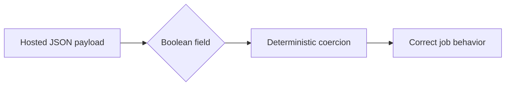

## item_049_day_captain_hosted_http_boolean_input_hardening - Parse hosted HTTP boolean inputs deterministically instead of relying on Python truthiness
> From version: 1.4.0
> Status: Ready
> Understanding: 98%
> Confidence: 96%
> Progress: 0%
> Complexity: Low
> Theme: Reliability
> Reminder: Update status/understanding/confidence/progress and linked task references when you edit this doc.

# Problem
- The hosted HTTP layer currently parses `force` with plain Python truthiness.
- That means inputs like `"false"` or `"0"` are still treated as truthy and can change digest behavior unexpectedly.
- The hosted API contract should be deterministic and safe for external clients, including low-code or hand-crafted JSON payloads.

# Scope
- In:
  - normalize hosted boolean parsing for job payloads such as `force`
  - preserve correct behavior for real JSON booleans
  - document the accepted/normalized boolean forms if coercion remains permissive
- Out:
  - broad schema validation for every hosted field
  - changing unrelated hosted job payload semantics
  - redesigning the hosted API surface

# Acceptance criteria
- AC1: Hosted boolean fields such as `force` no longer treat `"false"` or `"0"` as truthy.
- AC2: Valid JSON booleans remain supported.
- AC3: Automated tests cover the hardened parsing behavior.

# AC Traceability
- Req028 AC3 -> Scope explicitly hardens hosted boolean parsing. Proof: item is about deterministic HTTP booleans.
- Req028 AC5 -> Scope explicitly requires tests. Proof: input-contract fixes should be regression covered.

# Links
- Request: `req_028_day_captain_preview_safety_and_web_runtime_observability`
- Primary task(s): `task_033_day_captain_preview_safety_and_web_runtime_observability_orchestration` (`Ready`)

# Priority
- Impact: Medium - this can silently change runtime behavior for external callers.
- Urgency: Medium - it is an API correctness issue with real operational impact.

# Notes
- Derived from `req_028_day_captain_preview_safety_and_web_runtime_observability`.
- Preferred direction: bounded coercion or explicit rejection, not generic Python truthiness.
