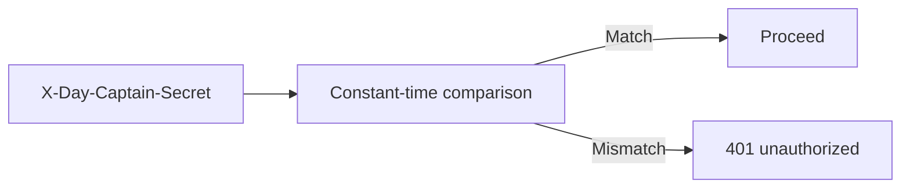

## item_052_day_captain_hosted_job_secret_constant_time_validation - Harden hosted X-Day-Captain-Secret validation with a constant-time comparison primitive
> From version: 1.4.1
> Status: Done
> Understanding: 100%
> Confidence: 96%
> Progress: 100%
> Complexity: Low
> Theme: Security
> Reminder: Update status/understanding/confidence/progress and linked task references when you edit this doc.

# Problem
- Hosted job endpoints are protected by the shared secret header `X-Day-Captain-Secret`.
- The current implementation compares the received secret to the configured secret with raw string equality.
- While the overall hosted model still depends on strong secrets and TLS, the comparison primitive itself should be upgraded to constant-time matching.

# Scope
- In:
  - replace raw secret equality with a constant-time comparison primitive
  - keep the existing endpoint contract and header name unchanged
  - add tests that cover successful and failed secret validation
- Out:
  - moving away from shared-secret auth entirely
  - introducing signed requests, OAuth, mTLS, or IP-based allowlists
  - changing public operator workflows or endpoint shapes

# Acceptance criteria
- AC1: Hosted secret validation uses a constant-time comparison primitive.
- AC2: Matching and non-matching secrets behave exactly as before from an HTTP-contract perspective.
- AC3: Tests cover successful and rejected authentication paths.

# AC Traceability
- Req029 AC3 -> Item scope explicitly hardens secret validation without changing the external contract. Proof: the item replaces raw equality while preserving the same header-based auth model.
- Req029 AC4 -> Acceptance criteria require tests for allowed and rejected secret validation paths. Proof: runtime hardening is not complete until both outcomes are covered.

# Links
- Request: `req_029_day_captain_hosted_graph_boundary_and_job_secret_hardening`
- Primary task(s): `task_034_day_captain_hosted_graph_boundary_and_job_secret_hardening_orchestration` (`Done`)

# Priority
- Impact: Medium - the surface is small but production-facing and worth hardening.
- Urgency: Medium - low implementation cost and clear security hygiene win.

# Notes
- Derived from `req_029_day_captain_hosted_graph_boundary_and_job_secret_hardening`.
- This item intentionally improves the primitive only; it does not replace broader secret-management hygiene.
- Closed on Monday, March 9, 2026 after replacing raw secret equality with a constant-time comparison path and locking the hosted auth behavior with regression tests.
