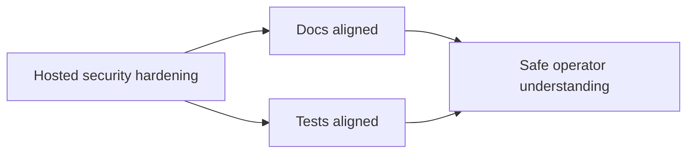

## item_053_day_captain_hosted_security_docs_and_validation_alignment - Align operator docs and tests with the hosted Graph boundary and secret-hardening contract
> From version: 1.4.1
> Status: Ready
> Understanding: 100%
> Confidence: 94%
> Progress: 0%
> Complexity: Low
> Theme: Security
> Reminder: Update status/understanding/confidence/progress and linked task references when you edit this doc.

# Problem
- Once the hosted Graph trust boundary and secret-comparison hardening are in place, docs and tests must describe the new runtime behavior precisely.
- Without that alignment, operators may not understand why a cross-origin `nextLink` is rejected or may assume a broader API-auth redesign happened when it did not.

# Scope
- In:
  - update operator-facing docs to describe the trusted Graph origin policy
  - document that job-endpoint auth is still a shared-secret model, now with hardened comparison
  - ensure automated coverage and validation notes reflect the new contract
- Out:
  - broader security policy documentation beyond this hosted slice
  - local developer token-cache guidance beyond existing docs
  - unrelated deployment or scheduler changes

# Acceptance criteria
- AC1: Operator docs describe the Graph trusted-origin rule and its bounded failure mode.
- AC2: Operator docs do not overstate the job-endpoint security model beyond shared secret plus TLS.
- AC3: Validation artifacts cover the new trust-boundary and secret-hardening behavior.

# AC Traceability
- Req029 AC4 -> Acceptance criteria require coverage for the hardened runtime behavior. Proof: this item closes only once tests and validation notes reflect the final behavior.
- Req029 AC5 -> Item scope explicitly aligns operator docs with the final hosted contract. Proof: the item exists specifically to document the trusted-origin rule and bounded shared-secret model accurately.

# Links
- Request: `req_029_day_captain_hosted_graph_boundary_and_job_secret_hardening`
- Primary task(s): `task_034_day_captain_hosted_graph_boundary_and_job_secret_hardening_orchestration` (`Ready`)

# Priority
- Impact: Medium - the code change is security-sensitive and should not land without clear operator guidance.
- Urgency: Medium - doc drift would weaken the value of the hardening work.

# Notes
- Derived from `req_029_day_captain_hosted_graph_boundary_and_job_secret_hardening`.
- This item should close only after tests and docs both reflect the final production contract.
