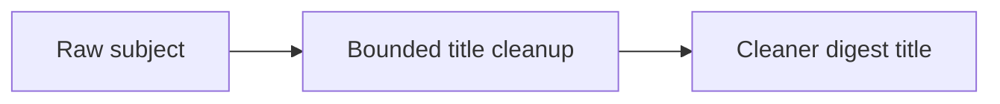

## item_054_day_captain_digest_card_title_cleanup_heuristics - Clean awkward subject-derived digest card titles while preserving useful context
> From version: 1.4.1
> Status: Ready
> Understanding: 100%
> Confidence: 96%
> Progress: 0%
> Complexity: Medium
> Theme: Product Quality
> Reminder: Update status/understanding/confidence/progress and linked task references when you edit this doc.

# Problem
- Some digest cards still surface raw or awkward email-subject carry-over such as `RE: A imprimer`.
- These titles make the digest feel machine-assembled even when the underlying prioritization is correct.
- The cleanup problem is bounded: the title should be more readable, but not at the cost of losing the source context entirely.

# Scope
- In:
  - normalize noisy reply/forward prefixes when they do not add value
  - improve title cleanup heuristics for common subject patterns
  - preserve high-signal source context when it is genuinely useful
- Out:
  - full semantic title generation from scratch for every item
  - changing the underlying message ranking logic
  - broad section-level wording changes

# Acceptance criteria
- AC1: Obvious noisy reply/forward carry-over is reduced in digest card titles.
- AC2: Cleaned titles remain understandable without needing the raw mailbox subject beside them.
- AC3: Tests cover representative cleanup cases and no-regression cases.

# AC Traceability
- Req030 AC1 -> Item scope explicitly cleans awkward subject-derived titles. Proof: this item is the dedicated title-quality slice.
- Req030 AC5 -> Acceptance criteria require representative regression coverage. Proof: title cleanup must be locked with tests before closure.

# Links
- Request: `req_030_day_captain_digest_editorial_relevance_and_copy_quality`
- Primary task(s): `task_035_day_captain_digest_editorial_relevance_and_copy_quality_orchestration` (`Ready`)

# Priority
- Impact: High - titles are the first thing users scan and strongly affect perceived digest quality.
- Urgency: Medium - the digest is usable now, but awkward titles visibly reduce trust.

# Notes
- Derived from `req_030_day_captain_digest_editorial_relevance_and_copy_quality`.
