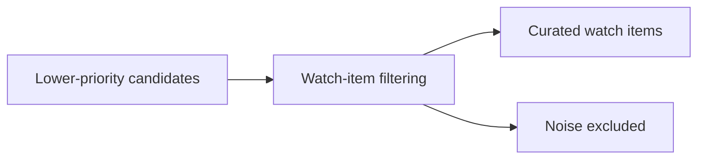

## item_055_day_captain_digest_watch_item_noise_reduction - Reduce low-signal noise in watch_items / À surveiller
> From version: 1.4.1
> Status: Done
> Understanding: 100%
> Confidence: 95%
> Progress: 100%
> Complexity: Medium
> Theme: Product Quality
> Reminder: Update status/understanding/confidence/progress and linked task references when you edit this doc.

# Problem
- `À surveiller` / `Watch items` can still include messages that feel weakly filtered or not decision-useful.
- That noise hurts the credibility of the digest even when the more urgent sections are good.
- The section should feel curated: lower-priority than actions/critical topics, but still worth reading.

# Scope
- In:
  - tighten scoring or filtering heuristics for `watch_items`
  - remove or deprioritize obviously weak-signal messages
  - keep legitimate “worth remembering” items visible
- Out:
  - redesigning the global section model
  - changing critical/action-item semantics
  - explicit per-user feedback loops from inside the digest

# Acceptance criteria
- AC1: Representative previews/live samples show fewer obviously noisy watch items.
- AC2: Tightening `watch_items` does not accidentally hollow out the section in normal business mail scenarios.
- AC3: Tests cover the revised scoring/filtering behavior.

# AC Traceability
- Req030 AC2 -> Item scope explicitly reduces `watch_items` noise. Proof: this item is the relevance/filtering slice for that section.
- Req030 AC5 -> Acceptance criteria require updated coverage for the revised watch-item heuristics. Proof: scoring changes must be regression-tested.

# Links
- Request: `req_030_day_captain_digest_editorial_relevance_and_copy_quality`
- Primary task(s): `task_035_day_captain_digest_editorial_relevance_and_copy_quality_orchestration` (`Done`)

# Priority
- Impact: High - noisy watch items materially weaken digest usefulness.
- Urgency: Medium - this is now one of the most visible remaining product-quality issues.

# Notes
- Derived from `req_030_day_captain_digest_editorial_relevance_and_copy_quality`.
- Closed on Monday, March 9, 2026 after tightening low-signal watch-item filtering and dropping obvious article-style noise.
