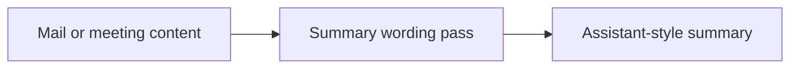

## item_056_day_captain_digest_decision_oriented_summary_wording - Make digest summaries more decision-oriented and less literal
> From version: 1.4.1
> Status: Ready
> Understanding: 100%
> Confidence: 95%
> Progress: 0%
> Complexity: Medium
> Theme: Product Quality
> Reminder: Update status/understanding/confidence/progress and linked task references when you edit this doc.

# Problem
- Several digest summaries still read like slightly cleaned email body snippets rather than assistant-style guidance.
- This is especially visible in watch items and some action cards where the summary should answer “why should I care / what should I do?”
- The digest needs stronger editorial compression without inventing facts or over-interpreting intent.

# Scope
- In:
  - improve deterministic summary heuristics and/or bounded LLM guidance
  - prefer decision-oriented, action-aware wording over literal excerpts
  - preserve factual accuracy and source grounding
- Out:
  - switching the digest to fully generative summaries
  - removing deterministic fallback behavior
  - altering the overall section structure

# Acceptance criteria
- AC1: Representative summaries read more like assistant guidance and less like pasted email text.
- AC2: Summary cleanup preserves the actionable core and does not fabricate decisions or intent.
- AC3: Tests cover the new wording heuristics or post-processing rules.

# AC Traceability
- Req030 AC3 -> Item scope explicitly targets decision-oriented summaries. Proof: this item is the summary-quality slice.
- Req030 AC5 -> Acceptance criteria require updated coverage for the wording changes. Proof: this change must be regression-tested before closure.

# Links
- Request: `req_030_day_captain_digest_editorial_relevance_and_copy_quality`
- Primary task(s): `task_035_day_captain_digest_editorial_relevance_and_copy_quality_orchestration` (`Ready`)

# Priority
- Impact: High - summary quality is central to whether users trust the digest as an assistant product.
- Urgency: Medium - the digest already works, but this is the main remaining quality lever.

# Notes
- Derived from `req_030_day_captain_digest_editorial_relevance_and_copy_quality`.
