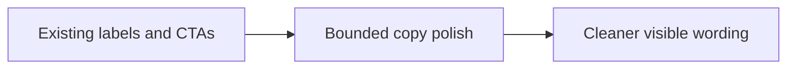

## item_057_day_captain_digest_microcopy_and_cta_polish - Polish labels, badges, and CTA wording without reopening layout work
> From version: 1.4.1
> Status: Done
> Understanding: 100%
> Confidence: 94%
> Progress: 100%
> Complexity: Low
> Theme: Product Quality
> Reminder: Update status/understanding/confidence/progress and linked task references when you edit this doc.

# Problem
- Small copy details still create friction in the live digest, such as rough section labels, casing, or repetitive CTA wording.
- These issues do not justify a new layout pass, but they do affect the sense of polish.

# Scope
- In:
  - polish visible labels such as weather-related copy where useful
  - refine badge wording and CTA labels when repetition or awkwardness is visible
  - keep Outlook-safe rendering stable
- Out:
  - major design or layout changes
  - CTA behavior redesign
  - localization overhaul beyond the bounded polish pass

# Acceptance criteria
- AC1: Visible labels and CTAs are cleaner and more intentional in representative digest samples.
- AC2: The copy polish does not make open behaviors less clear.
- AC3: Tests/docs are updated when user-visible copy contracts change materially.

# AC Traceability
- Req030 AC4 -> Item scope explicitly targets the bounded copy-polish surface. Proof: this item exists to improve labels, badges, and CTA wording without reopening layout work.
- Req030 AC5 -> Acceptance criteria require aligned docs/tests when visible copy contracts change materially. Proof: copy changes should be documented and covered where needed.

# Links
- Request: `req_030_day_captain_digest_editorial_relevance_and_copy_quality`
- Primary task(s): `task_035_day_captain_digest_editorial_relevance_and_copy_quality_orchestration` (`Done`)

# Priority
- Impact: Medium - these issues are smaller than scoring/writing quality, but they still affect the product feel.
- Urgency: Medium - worth bundling with the editorial cleanup pass rather than leaving as residue.

# Notes
- Derived from `req_030_day_captain_digest_editorial_relevance_and_copy_quality`.
- Closed on Monday, March 9, 2026 after polishing French weather and meeting CTA labels without changing the underlying interaction model.
