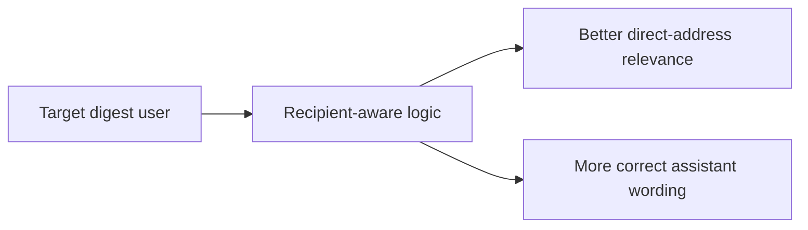

## item_058_day_captain_recipient_aware_digest_identity_and_direct_address_relevance - Make the digest recipient-aware and improve direct-address relevance
> From version: 1.4.2
> Status: Done
> Understanding: 100%
> Confidence: 98%
> Progress: 99%
> Complexity: Medium
> Theme: Product Quality
> Reminder: Update status/understanding/confidence/progress and linked task references when you edit this doc.

# Problem
- The digest does not yet behave consistently as if it knows exactly who it is addressing from the existing target-user context.
- Live feedback from a target digest user shows a trust gap: the brief can mention the recipient inside card content, but still fails to clearly treat messages addressed to that person as a first-class relevance signal.
- Without recipient-aware identity handling, wording and prioritization stay too generic for a multi-user assistant product.

# Scope
- In:
  - use the explicit target digest user identity more consistently in wording and relevance rules without requiring per-user manual reminders
  - improve handling of emails directly addressed to the target user
  - preserve mailbox-scoped behavior so multi-user runs remain explicit and safe
- Out:
  - building a general people-directory resolution engine
  - changing delivery routing or authorization contracts
  - adding new user-controlled profile settings beyond the existing target-user model

# Acceptance criteria
- AC1: The digest consistently knows which target user it addresses from the existing target-user context and avoids generic or ambiguous recipient wording where that identity is available.
- AC2: Emails directly addressed to the target user can influence relevance and/or wording more clearly than before.
- AC3: Tests cover representative identity-aware cases without regressing explicit multi-user scoping.

# AC Traceability
- Req031 AC1 -> Item scope explicitly targets recipient-aware identity and direct-address relevance. Proof: this item is the dedicated recipient-personalization slice.
- Req031 AC5 -> Acceptance criteria require regression coverage. Proof: the recipient-aware behavior must be locked with tests before closure.

# Links
- Request: `req_031_day_captain_recipient_aware_digest_identity_mail_summaries_language_coherence_and_meeting_chronology`
- Primary task(s): `task_036_day_captain_recipient_aware_digest_logic_and_meeting_correctness_orchestration` (`Done`)

# Priority
- Impact: High - if the digest addresses the wrong person generically, the assistant loses credibility.
- Urgency: High - this is a correctness and trust issue surfaced directly by user feedback.

# Notes
- Derived from direct user feedback on the digest delivered to the target digest user on Tuesday, March 10, 2026.
- Completed on Tuesday, March 10, 2026 after shipping target-recipient display-name awareness, direct-address relevance scoring, and regression coverage for mailbox-scoped recipient-aware behavior.
