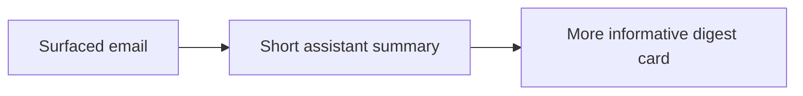

## item_059_day_captain_per_mail_assistant_summaries - Add short assistant-style summaries for every surfaced mail card
> From version: 1.4.2
> Status: Draft
> Understanding: 97%
> Confidence: 95%
> Progress: 0%
> Complexity: Medium
> Theme: Product Quality
> Reminder: Update status/understanding/confidence/progress and linked task references when you edit this doc.

# Problem
- Surfaced mail cards still rely too heavily on cleaned excerpts or body previews.
- User feedback explicitly asks for a brief summary for each email, ideally grounded enough to be useful at a glance.
- The digest already prioritizes messages, but it still does not consistently explain each selected mail in a short assistant-style form.

# Scope
- In:
  - add a short summary layer for every surfaced mail card
  - allow bounded LLM assistance when configured, with deterministic fallback behavior
  - preserve factual grounding in the source mail
- Out:
  - replacing all mail-card content with freeform generative text
  - summarizing messages that are not surfaced in the digest
  - expanding card layouts beyond the current bounded rendering model

# Acceptance criteria
- AC1: Each surfaced mail card contains a short summary that is more useful than a raw excerpt alone.
- AC2: Summaries stay grounded in the source email and do not fabricate actions or facts.
- AC3: Tests cover representative summary-generation and fallback cases.

# AC Traceability
- Req031 AC2 -> Item scope explicitly adds per-mail summaries. Proof: this item is the dedicated card-summary slice.
- Req031 AC5 -> Acceptance criteria require regression coverage. Proof: summary generation must be bounded by tests before closure.

# Links
- Request: `req_031_day_captain_recipient_aware_digest_identity_mail_summaries_language_coherence_and_meeting_chronology`
- Primary task(s): `task_036_day_captain_recipient_aware_digest_logic_and_meeting_correctness_orchestration` (`Draft`)

# Priority
- Impact: High - card summaries are one of the main product surfaces users read.
- Urgency: Medium - the digest works today, but the summaries are still too excerpt-like.

# Notes
- Derived from the same March 10, 2026 feedback asking for a concise summary on every mail card.
