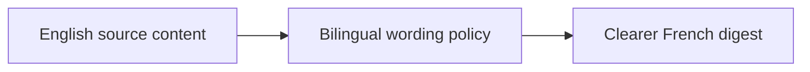

## item_060_day_captain_french_digest_bilingual_term_preservation - Preserve key English terms and bilingual coherence in French digests
> From version: 1.4.2
> Status: Done
> Understanding: 99%
> Confidence: 97%
> Progress: 100%
> Complexity: Medium
> Theme: Product Quality
> Reminder: Update status/understanding/confidence/progress and linked task references when you edit this doc.

# Problem
- French digest wording can currently translate or paraphrase English-source content in a way that makes the original meaning less clear.
- This is especially visible in `En bref`, where forced French phrasing can reduce comprehension instead of helping it.
- User feedback explicitly prefers coherence over pure translation, even if that means preserving FR-English terminology.

# Scope
- In:
  - define bounded language rules for English-source content inside French digests
  - preserve key English terms when translation would reduce clarity
  - improve `En bref` and downstream summary wording so mixed FR-English remains intentional and readable
- Out:
  - adding full multilingual translation support
  - changing the global digest language-selection contract
  - rewriting all content into source-language-only mode

# Acceptance criteria
- AC1: French digest wording no longer obscures the meaning of English-source emails in representative cases.
- AC2: `En bref` and card summaries preserve key English terms or mixed terminology when that is clearer than forced translation.
- AC3: Tests cover the new bilingual wording rules and representative English-source examples.

# AC Traceability
- Req031 AC3 -> Item scope explicitly targets bilingual coherence and preserved English terms. Proof: this item is the language-policy slice.
- Req031 AC5 -> Acceptance criteria require regression coverage. Proof: wording-policy changes must be locked with tests before closure.

# Links
- Request: `req_031_day_captain_recipient_aware_digest_identity_mail_summaries_language_coherence_and_meeting_chronology`
- Primary task(s): `task_036_day_captain_recipient_aware_digest_logic_and_meeting_correctness_orchestration` (`Done`)

# Priority
- Impact: High - comprehension drops quickly when translation hides the original business meaning.
- Urgency: High - this came through as a direct user pain point in the live digest.

# Notes
- Derived from user feedback that the French translation of English emails was actively confusing inside the digest.
- Completed on Tuesday, March 10, 2026 after adding bounded bilingual wording rules for English-source mail summaries and deterministic `En bref` fallback reuse of structured briefing content.
