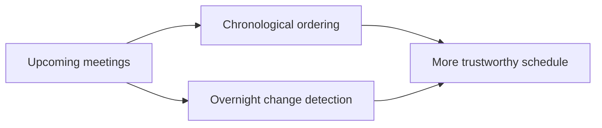

## item_061_day_captain_meeting_chronology_and_overnight_change_highlighting - Render meetings in chronological order and highlight overnight changes
> From version: 1.4.2
> Status: Draft
> Understanding: 99%
> Confidence: 97%
> Progress: 5%
> Complexity: Medium
> Theme: Product Quality
> Reminder: Update status/understanding/confidence/progress and linked task references when you edit this doc.

# Problem
- The upcoming meetings section can currently render meetings out of order, which breaks a basic trust expectation.
- The live sample shows a 10:00 meeting placed after an 11:00 meeting.
- Feedback also asks for clearer visibility when a meeting was cancelled, moved, or newly created overnight because those changes affect the day plan more than an unchanged meeting does.

# Scope
- In:
  - enforce strict chronological ordering for upcoming meetings
  - highlight meaningful overnight meeting changes such as cancelled, moved, or new meetings
  - improve top-summary visibility for those changes when they materially affect the schedule
- Out:
  - changing meeting ingestion horizons or RSVP features
  - redesigning the meeting card layout beyond bounded clarity improvements
  - full calendar-diff history beyond the digest window and available source data

# Acceptance criteria
- AC1: Upcoming meetings are rendered in strict chronological order in representative digest outputs.
- AC2: Cancelled, moved, or newly added meetings can be surfaced more prominently when they changed within the digest window.
- AC3: Tests cover meeting ordering and representative overnight-change visibility cases.

# AC Traceability
- Req031 AC4 -> Item scope explicitly targets chronological meeting rendering and change visibility. Proof: this item is the meeting-correctness slice.
- Req031 AC5 -> Acceptance criteria require regression coverage. Proof: meeting correctness must be verified by tests before closure.

# Links
- Request: `req_031_day_captain_recipient_aware_digest_identity_mail_summaries_language_coherence_and_meeting_chronology`
- Primary task(s): `task_036_day_captain_recipient_aware_digest_logic_and_meeting_correctness_orchestration` (`Draft`)

# Priority
- Impact: High - wrong meeting order is a direct correctness bug in the daily brief.
- Urgency: High - this is visible immediately in the delivered digest and affects planning confidence.

# Notes
- Derived from live user feedback on Tuesday, March 10, 2026 after reviewing the delivered morning brief.
- Synchronization note: the newer `item_065_day_captain_per_meeting_assistant_briefings_with_related_context` and `item_068_day_captain_all_day_presence_event_classification_and_rendering` extend this meeting-correctness slice into the new assistant-briefing model. Execution should be synchronized there rather than duplicated separately.
