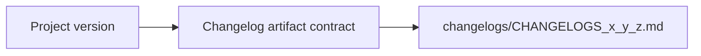

## item_062_day_captain_versioned_changelog_artifact_contract - Define the changelogs artifact contract and versioned filename strategy
> From version: 1.4.2
> Status: Done
> Understanding: 99%
> Confidence: 98%
> Progress: 100%
> Complexity: Medium
> Theme: Delivery Quality
> Reminder: Update status/understanding/confidence/progress and linked task references when you edit this doc.

# Problem
- Day Captain does not yet define a repository-level contract for versioned changelog artifacts.
- Without a stable folder and filename convention, changelog generation will drift and remain ad hoc.
- The repo already has a version source of truth in `pyproject.toml`, but that version is not yet connected to changelog artifacts.

# Scope
- In:
  - define the root `changelogs/` folder convention
  - define the versioned filename contract, aligned with the reference pattern `CHANGELOGS_x_y_z.md`
  - define how the current project version is resolved locally for changelog naming
- Out:
  - building a changelog UI or reader
  - remote publishing or release automation outside the repository
  - full historical changelog backfill

# Acceptance criteria
- AC1: Day Captain defines a stable `changelogs/CHANGELOGS_x_y_z.md` artifact convention.
- AC2: The changelog filename version is sourced from the real current project version.
- AC3: Docs and/or supporting automation notes describe how the artifact contract is used.

# AC Traceability
- Req032 AC1 -> Item scope explicitly defines the root artifact contract. Proof: this item is the contract slice.
- Req032 AC2 -> Item scope explicitly ties filenames to the real current project version. Proof: this item is the version-resolution slice.
- Req032 AC4 -> Acceptance criteria require aligned docs or automation notes. Proof: the contract is incomplete without usage guidance.

# Links
- Request: `req_032_day_captain_versioned_changelog_generation_and_delivery_closure_alignment`
- Primary task(s): `task_037_day_captain_versioned_changelog_generation_and_delivery_alignment` (`Done`)

# Priority
- Impact: Medium - release artifacts become clearer and easier to track once the contract exists.
- Urgency: Medium - this is a process-improvement slice, not a runtime blocker.

# Notes
- Derived from the Day Captain decision to adopt a versioned `changelogs/` pattern similar to `electrical-plan-editor`.
- Completed on Tuesday, March 10, 2026 after shipping the `changelogs/` folder contract, helper utilities, generation script, README guidance, and the first release artifact for `1.5.0`.
