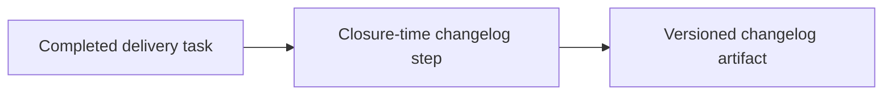

## item_063_day_captain_changelog_generation_delivery_closure_process_alignment - Align delivery closure workflow and docs with changelog generation
> From version: 1.4.2
> Status: Done
> Understanding: 99%
> Confidence: 97%
> Progress: 100%
> Complexity: Medium
> Theme: Delivery Quality
> Reminder: Update status/understanding/confidence/progress and linked task references when you edit this doc.

# Problem
- Even with a changelog filename convention, Day Captain still needs a clear delivery rule for when changelog files are generated.
- The reference project uses changelog generation at task closure time so the filename matches the actual project version when delivery is finished.
- Without explicit closure alignment, changelog files risk being created too early or omitted entirely.

# Scope
- In:
  - define changelog generation as a closure-time delivery step
  - update task/orchestration guidance so shipped work includes changelog generation
  - align validation and docs with the new closure expectation
- Out:
  - automatic release publishing
  - mandatory changelog generation for drafts or incomplete work
  - rewriting the whole Logics workflow beyond the bounded changelog addition

# Acceptance criteria
- AC1: Delivery task guidance explicitly includes changelog generation at closure time for shipped work.
- AC2: Changelog generation does not require guessing the release version before the work is actually closed.
- AC3: Validation/docs are updated so the changelog expectation is visible and repeatable.

# AC Traceability
- Req032 AC3 -> Item scope explicitly adds closure-time changelog generation to delivery workflow. Proof: this item is the process-alignment slice.
- Req032 AC4 -> Acceptance criteria require validation/doc updates. Proof: the new workflow must be visible and repeatable before closure.

# Links
- Request: `req_032_day_captain_versioned_changelog_generation_and_delivery_closure_alignment`
- Primary task(s): `task_037_day_captain_versioned_changelog_generation_and_delivery_alignment` (`Done`)

# Priority
- Impact: Medium - process alignment is what makes the changelog contract actually stick.
- Urgency: Medium - useful now, but not a product-runtime correctness issue.

# Notes
- Derived from the decision to adopt the closure-time changelog pattern already proven in `electrical-plan-editor`.
- Completed on Tuesday, March 10, 2026 after aligning README guidance, closure validation, and generation workflow around the real project version resolved at delivery time.
