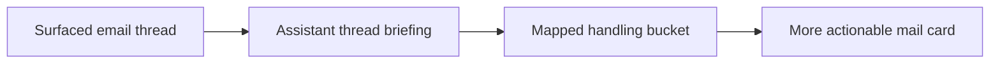

## item_064_day_captain_per_thread_assistant_briefings_and_handling_contract - Day Captain per-thread assistant briefings and handling contract
> From version: 1.4.2
> Status: Draft
> Understanding: 97%
> Confidence: 95%
> Progress: 0%
> Complexity: High
> Theme: Product Quality
> Reminder: Update status/understanding/confidence/progress and linked task references when you edit this doc.

# Problem
- Surfaced mail cards still rely too much on excerpts, cleaned fragments, or lightweight summary behavior instead of explaining what an email thread actually means.
- The new product direction is to treat the surfaced thread as the unit of understanding, not just the latest message, so the digest can explain what the conversation is about and what the user should do next.
- Without a clear per-thread output contract, generated summaries can drift into vague prose, lose the existing bucket logic, or fabricate actions not grounded in the thread.

# Scope
- In:
  - generate assistant-style briefings for each surfaced email thread using the selected message plus available thread context
  - preserve an explicit handling outcome mapped to the current digest logic rather than inventing a new open-ended taxonomy
  - keep the thread briefing grounded in the available source thread and bounded enough to remain practical
  - allow deterministic fallback behavior when the thread briefing cannot be generated safely
- Out:
  - summarizing unsurfaced messages
  - autonomous mail actions or reply drafting
  - replacing the digest’s overall prioritization model with unconstrained LLM judgment

# Acceptance criteria
- AC1: Each surfaced mail card can include a short assistant-style briefing derived from the surfaced thread context rather than mainly from raw excerpts.
- AC2: The thread briefing states what the thread is about and what the user should do with it without inventing unsupported facts or actions.
- AC3: The thread briefing includes a handling outcome mapped back to the current digest logic.
- AC4: Tests cover representative multi-message thread cases, direct action cases, and fallback cases.

# AC Traceability
- Req033 AC1 -> Item scope explicitly adds per-thread assistant briefings. Proof: this item is the mail-thread briefing slice.
- Req033 AC3 -> Acceptance criteria preserve a bounded handling outcome aligned with the current digest logic. Proof: this item is the mail handling-contract slice.
- Req033 AC7 -> Acceptance criteria and scope require bounded, grounded behavior with fallback. Proof: thread context use stays practical and safe before closure.

# Links
- Request: `req_033_day_captain_per_thread_and_per_meeting_assistant_briefings_with_confidence_scoring`
- Primary task(s): `task_038_day_captain_assistant_briefings_confidence_and_overview_orchestration` (`Draft`)

# Priority
- Impact: High - mail cards are one of the main digest surfaces and currently under-explain what the conversation means.
- Urgency: High - this is part of the core product shift away from mechanical excerpts.

# Notes
- Created on Tuesday, March 10, 2026 from product direction to summarize surfaced email threads as assistant briefings instead of excerpt-oriented cards.
