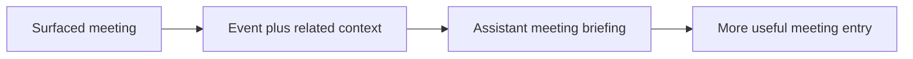

## item_065_day_captain_per_meeting_assistant_briefings_with_related_context - Day Captain per-meeting assistant briefings with related context
> From version: 1.4.2
> Status: Done
> Understanding: 100%
> Confidence: 97%
> Progress: 100%
> Complexity: High
> Theme: Product Quality
> Reminder: Update status/understanding/confidence/progress and linked task references when you edit this doc.

# Problem
- Upcoming meetings still risk reading like thin calendar lines even when the user needs a short explanation of why a meeting matters today.
- The product direction now expects meeting entries to behave more like assistant briefings, using more than bare event metadata when related context is available.
- Without a dedicated meeting-briefing slice, the digest can remain too shallow on calendar items and fail to explain preparation, follow-up, or monitoring needs.

# Scope
- In:
  - generate assistant-style briefings for surfaced meetings
  - use related context when available instead of relying only on bare event fields
  - keep meeting briefings grounded in the event and related context that Day Captain already has or can safely derive
  - preserve practical fallbacks when meeting context is sparse
- Out:
  - RSVP management, rescheduling, or calendar write-back workflows
  - arbitrary external context gathering beyond the existing product boundaries
  - redesigning the visual layout of meeting cards

# Acceptance criteria
- AC1: Each surfaced meeting can include a short assistant-style briefing that explains why it matters now and whether any preparation, follow-up, or monitoring is needed.
- AC2: When relevant related context exists, the meeting briefing can use it to improve usefulness over a bare event-only summary.
- AC3: When meeting context is sparse, fallback behavior remains informative rather than failing closed or producing empty assistant text.
- AC4: Tests cover representative meeting briefings with and without extra related context.

# AC Traceability
- Req033 AC2 -> Item scope explicitly adds assistant briefings for surfaced meetings. Proof: this item is the meeting-briefing slice.
- Req033 AC7 -> Acceptance criteria require bounded use of meeting and related context with fallback. Proof: this item keeps the meeting path practical and safe.
- Req033 AC8 -> Acceptance criteria require coverage for meeting briefings with extra related context. Proof: representative regression cases are part of closure.

# Links
- Request: `req_033_day_captain_per_thread_and_per_meeting_assistant_briefings_with_confidence_scoring`
- Primary task(s): `task_038_day_captain_assistant_briefings_confidence_and_overview_orchestration` (`Done`)

# Priority
- Impact: High - meetings are a core part of the daily brief and need stronger assistant interpretation to be useful.
- Urgency: Medium - this is a major quality improvement, though less immediate than obvious thread-summary weaknesses.

# Notes
- Created on Tuesday, March 10, 2026 from product direction to extend assistant-style interpretation from mail cards to surfaced meetings.
- Closed on Tuesday, March 10, 2026 after implementing meeting briefings with related mail context, bounded fallback behavior, and regression coverage.
