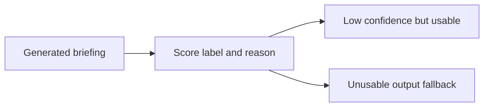

## item_066_day_captain_digest_confidence_signals_and_low_confidence_fallback_behavior - Day Captain digest confidence signals and low-confidence fallback behavior
> From version: 1.4.2
> Status: Done
> Understanding: 100%
> Confidence: 97%
> Progress: 100%
> Complexity: Medium
> Theme: Product Quality
> Reminder: Update status/understanding/confidence/progress and linked task references when you edit this doc.

# Problem
- A richer assistant-summary layer needs a trust signal so users can judge whether a per-thread or per-meeting account looks solid or should be treated cautiously.
- A raw numeric score alone would create false precision if the system cannot also explain why confidence is high or low.
- The product direction explicitly requires low-confidence but still usable briefings to remain visible with a warning, while unusable outputs still need deterministic fallback.

# Scope
- In:
  - define the confidence contract for generated mail-thread and meeting briefings
  - present confidence as a score, a label, and a short reason
  - define low-confidence rendering behavior versus unusable-output fallback behavior
  - keep confidence explainable in product terms rather than as opaque model internals
- Out:
  - claiming scientific probability or formal calibration accuracy
  - model-evaluation research beyond the product signal needed for the digest
  - hiding low-confidence items by default when the generated briefing is still usable

# Acceptance criteria
- AC1: Each generated mail-thread or meeting briefing includes a confidence signal with a bounded score, a label, and a short reason.
- AC2: Confidence is presented as guidance to the user rather than as unexplained certainty or fake precision.
- AC3: Low-confidence but usable briefings stay visible with their confidence signal.
- AC4: Unusable generated outputs can still fall back to deterministic behavior safely.
- AC5: Tests cover representative high-confidence, low-confidence, and fallback cases.

# AC Traceability
- Req033 AC4 -> Item scope explicitly adds score, label, and reason confidence metadata. Proof: this item is the confidence-signal slice.
- Req033 AC5 -> Acceptance criteria explicitly preserve low-confidence visibility and deterministic fallback. Proof: this item is the low-confidence behavior slice.
- Req033 AC8 -> Acceptance criteria require representative confidence and fallback coverage. Proof: closure depends on regression tests for all three states.

# Links
- Request: `req_033_day_captain_per_thread_and_per_meeting_assistant_briefings_with_confidence_scoring`
- Primary task(s): `task_038_day_captain_assistant_briefings_confidence_and_overview_orchestration` (`Done`)

# Priority
- Impact: High - confidence is the main trust control for a more generative digest layer.
- Urgency: High - without it, the richer assistant behavior risks feeling arbitrary or unsafe.

# Notes
- Created on Tuesday, March 10, 2026 from product direction to expose confidence explicitly for each generated mail-thread and meeting briefing.
- Closed on Tuesday, March 10, 2026 after implementing score/label/reason confidence metadata, low-confidence rendering, and safe fallback preservation.
