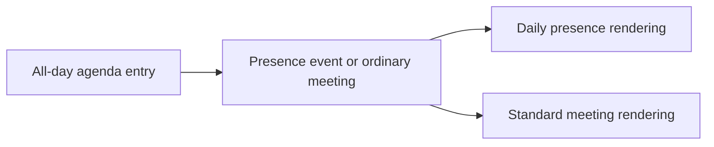

## item_068_day_captain_all_day_presence_event_classification_and_rendering - Day Captain all-day presence event classification and rendering
> From version: 1.4.2
> Status: Draft
> Understanding: 96%
> Confidence: 94%
> Progress: 0%
> Complexity: Medium
> Theme: Product Quality
> Reminder: Update status/understanding/confidence/progress and linked task references when you edit this doc.

# Problem
- Some all-day agenda entries are not really meetings. In this product context, entries such as `Site- Horizon`, `Télétravail`, and similar patterns can be used to indicate where the person is physically located or what their day-presence status is.
- If Day Captain treats those entries as ordinary meetings, the digest misrepresents the day plan and loses a useful operational signal about where the person is.
- This behavior depends on local business meaning that the model cannot infer reliably on its own, so it needs an explicit product rule.

# Scope
- In:
  - identify qualifying all-day agenda entries that should be treated as daily presence events rather than ordinary meetings
  - render those entries separately from standard meetings so the digest can expose where the person is expected to be for the day
  - keep the first implementation bounded to explicit all-day presence/location signals already visible in agenda data
- Out:
  - building a generalized attendance or HR-status system
  - inferring physical presence from weak ambiguous signals without an explicit rule
  - changing the meaning of ordinary meetings that merely happen to be long or important

# Acceptance criteria
- AC1: Qualifying all-day agenda entries that represent location or presence signals can be isolated from ordinary meetings in the digest.
- AC2: The rendered digest exposes those entries as daily presence events so the user can quickly understand where the person is expected to be on that day.
- AC3: Ordinary meetings are not incorrectly reclassified as presence events without an explicit qualifying rule.
- AC4: Tests cover representative all-day presence-event classification and rendering cases, including examples such as office-location and remote-work entries.

# AC Traceability
- Req033 AC2 supporting rule -> Item scope explicitly isolates qualifying all-day agenda entries from ordinary meetings. Proof: this item is the daily presence-event slice.
- Req033 AC8 -> Acceptance criteria require representative classification and rendering coverage. Proof: closure depends on tests for all-day presence cases.

# Links
- Request: `req_033_day_captain_per_thread_and_per_meeting_assistant_briefings_with_confidence_scoring`
- Primary task(s): `task_038_day_captain_assistant_briefings_confidence_and_overview_orchestration` (`Draft`)

# Priority
- Impact: High - this affects daily operational understanding of where the person is, not just wording quality.
- Urgency: Medium - the rule is important because the system cannot infer it safely without explicit product guidance.

# Notes
- Created on Tuesday, March 10, 2026 from domain-specific product guidance that all-day agenda entries can encode daily physical presence rather than meetings.
