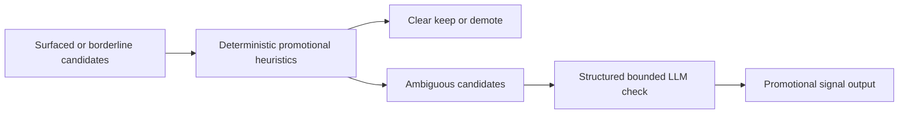

## item_077_day_captain_bounded_promotional_mail_classification - Add a bounded heuristic-first promotional classification step for surfaced mail
> From version: 1.5.2
> Status: Done
> Understanding: 100%
> Confidence: 97%
> Progress: 100%
> Complexity: Medium
> Theme: Product Quality
> Reminder: Update status/understanding/confidence/progress and linked task references when you edit this doc.

# Problem
- Targeted promotional emails can still survive the current deterministic scoring rules when they resemble an action-oriented message.
- The project needs a more explicit promotional signal than the current loose newsletter/outreach heuristics, but without turning the digest into an unbounded mailbox-wide classifier.
- The promotional signal should be structured enough to drive later scoring, rendering, and overview decisions.

# Scope
- In:
  - define a bounded promotional-signal contract for surfaced or borderline mail candidates
  - keep deterministic heuristics as the first-pass classifier
  - allow an optional structured LLM pass only for ambiguous surfaced candidates
  - preserve deterministic fallback behavior when LLM output is absent or unusable
- Out:
  - mailbox-wide spam detection across all collected mail
  - autonomous unsubscribe, sender blocking, or transport rules
  - replacing the existing digest scoring system with a pure LLM gate

# Acceptance criteria
- AC1: Surfaced or borderline mail candidates can receive an explicit bounded promotional signal rather than relying only on implicit noise heuristics.
- AC2: Deterministic heuristics remain the first-pass behavior, and any LLM use is limited to a bounded subset of surfaced or borderline candidates.
- AC3: When LLM classification is disabled, unavailable, or invalid, deterministic promotional handling still works without breaking digest generation.
- AC4: Tests cover representative promotional candidates, ambiguous cases, and fallback behavior.

# AC Traceability
- Req036 AC3 -> Item scope explicitly defines the bounded heuristic-first plus optional LLM classification model. Proof: this item exists to create that contract.
- Req036 AC5 -> Acceptance criteria preserve deterministic fallback when LLM output is absent or unusable. Proof: fallback is part of the item itself.
- Req036 AC6 -> Acceptance criteria require updated coverage for representative promotional and fallback cases. Proof: regression coverage belongs to the classification slice.

# Links
- Request: `req_036_day_captain_promotional_mail_detection_and_digest_deprioritization`
- Primary task(s): `task_041_day_captain_promotional_mail_handling_orchestration` (`Ready`)

# Priority
- Impact: High - bad promotional classification directly harms trust in the digest.
- Urgency: High - the false positive is already visible in live output.

# Notes
- Derived from `req_036_day_captain_promotional_mail_detection_and_digest_deprioritization`.
- The preferred contract is heuristic-first with a structured LLM fallback only for ambiguous surfaced candidates.
- Closed on Wednesday, March 11, 2026 after adding a bounded promotional signal, deterministic heuristics, structured LLM override support, and fallback coverage.
