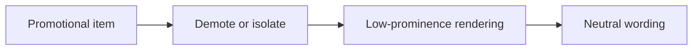

## item_078_day_captain_promotional_digest_demotion_and_neutral_rendering - Demote promotional items and remove action-forward rendering
> From version: 1.7.0
> Status: Done
> Understanding: 100%
> Confidence: 97%
> Progress: 100%
> Complexity: Medium
> Theme: Product Quality
> Reminder: Update status/understanding/confidence/progress and linked task references when you edit this doc.

# Problem
- Once a promotional email survives ranking, it can appear in `Actions à mener` / `Actions to take` and receive an action-forward recommendation that reads as if the assistant endorsed it.
- That presentation is worse than simple noise because it creates false urgency and can make the digest look unreliable.
- The product needs a bounded low-prominence handling mode for promotional items rather than treating them like genuine operational actions.

# Scope
- In:
  - use the promotional signal to demote items out of action-oriented sections
  - define whether promotional items are excluded entirely or rendered in a lower-prominence section
  - neutralize `À faire` / `Next step` wording for promotional items by default
  - keep the rendering contract legible and bounded in both text and HTML output
- Out:
  - broad redesign of the digest layout
  - generalized category management for many new mail classes
  - changing meeting rendering behavior

# Acceptance criteria
- AC1: Promotional items do not appear in `Actions à mener` / `Actions to take` unless a stronger validated non-promotional signal explicitly keeps them there.
- AC2: Promotional items rendered in the digest use neutral wording rather than action-forward recommendations by default.
- AC3: Text and HTML rendering remain stable when promotional items are demoted or isolated.
- AC4: Tests cover section placement and neutral-rendering behavior for representative promotional examples.

# AC Traceability
- Req036 AC1 -> Item scope explicitly removes promotional items from action-oriented sections. Proof: this is the visible demotion slice.
- Req036 AC4 -> Acceptance criteria require lower-prominence handling with neutral wording. Proof: demotion and neutral rendering belong to the same item.
- Req036 AC6 -> Tests are part of the item acceptance criteria. Proof: rendering and placement changes need regression coverage.

# Links
- Request: `req_036_day_captain_promotional_mail_detection_and_digest_deprioritization`
- Primary task(s): `task_041_day_captain_promotional_mail_handling_orchestration` (`Ready`)

# Priority
- Impact: High - this is the user-visible failure mode in the digest body.
- Urgency: High - action-oriented false positives should be corrected before more users see them.

# Notes
- Derived from `req_036_day_captain_promotional_mail_detection_and_digest_deprioritization`.
- The final rendering can either exclude promotional items or place them in a bounded low-prominence section, but it must not imply user urgency by default.
- Closed on Wednesday, March 11, 2026 after demoting promotional items out of action-oriented sections, neutralizing next-step wording, and rendering a bounded promo badge.
