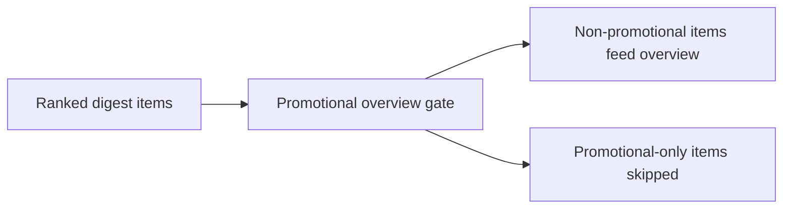

## item_079_day_captain_promotional_overview_exclusion_and_fallbacks - Exclude promotional items from En bref and preserve safe fallback behavior
> From version: 1.6.0
> Status: Ready
> Understanding: 99%
> Confidence: 96%
> Progress: 0%
> Complexity: Medium
> Theme: Product Quality
> Reminder: Update status/understanding/confidence/progress and linked task references when you edit this doc.

# Problem
- Promotional false positives become especially visible when the same item is repeated in `En bref` / `In brief`.
- The current overview synthesis can amplify a misclassified item because it operates after scoring and wording, not before a dedicated promotional exclusion gate.
- The digest needs an explicit rule that promotional items do not feed the top summary unless a stronger validated non-promotional reason overrides that decision.

# Scope
- In:
  - define the top-summary exclusion rule for promotional items
  - define the bounded override case where a stronger non-promotional signal can still keep an item visible in the overview
  - preserve deterministic fallback behavior if LLM-based promotional classification is unavailable
  - keep overview synthesis readable and stable after the exclusion rule is added
- Out:
  - rewriting the full overview system
  - broad changes to meeting summarization
  - new ranking surfaces outside the digest overview

# Acceptance criteria
- AC1: Promotional-only items do not appear in `En bref` / `In brief`.
- AC2: A stronger validated non-promotional signal can override the promotional exclusion only through an explicit bounded rule.
- AC3: Overview generation still has a deterministic fallback path when promotional classification metadata is missing or unusable.
- AC4: Tests cover overview exclusion, bounded override behavior, and fallback behavior.

# AC Traceability
- Req036 AC2 -> Item scope explicitly excludes promotional-only items from the overview. Proof: this is the top-summary slice.
- Req036 AC5 -> Acceptance criteria preserve deterministic fallback when promotional metadata is missing or unusable. Proof: overview behavior must remain safe without LLM output.
- Req036 AC6 -> Tests are part of the item acceptance criteria. Proof: overview exclusion and override behavior need coverage.

# Links
- Request: `req_036_day_captain_promotional_mail_detection_and_digest_deprioritization`
- Primary task(s): `task_041_day_captain_promotional_mail_handling_orchestration` (`Ready`)

# Priority
- Impact: High - repeating a promotional false positive in the overview makes the digest look materially less trustworthy.
- Urgency: High - overview repetition amplifies the same defect across the most visible area of the mail.

# Notes
- Derived from `req_036_day_captain_promotional_mail_detection_and_digest_deprioritization`.
- This item keeps the overview contract explicit: promotional-only items should not be summarized as priorities.
