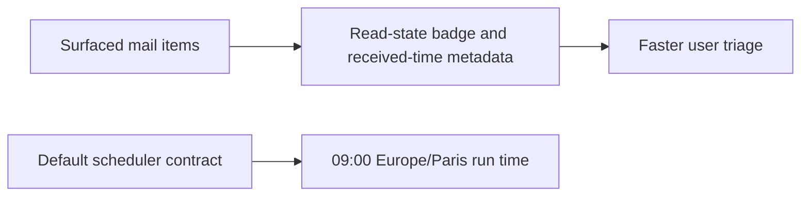

## item_080_day_captain_unread_mail_indicators_received_time_display_and_9am_daily_schedule - Day Captain unread mail indicators received time display and 9am daily schedule
> From version: 1.7.0
> Status: Done
> Understanding: 100%
> Confidence: 96%
> Progress: 100%
> Complexity: Medium
> Theme: UX
> Reminder: Update status/understanding/confidence/progress and linked task references when you edit this doc.

# Problem
- Make mail items in the digest easier to scan by showing whether the underlying message is still unread or has already been opened.
- Preserve the current benefit of resurfacing already opened emails, while making unread items immediately distinguishable through a visible indicator such as an `Unread` badge.
- Add the mail reception time as low-prominence metadata so the user can quickly judge message freshness without opening Outlook.
- Move the default daily digest schedule to `09:00 Europe/Paris`.

# Scope
- In:
  - exposing mail read state on surfaced digest items using a compact visible cue
  - preserving current surfacing eligibility for already read but still relevant emails
  - showing each surfaced mail item's received time as secondary metadata
  - updating the supported default daily scheduler time to `09:00 Europe/Paris` where this repository defines or documents that default
  - regression coverage and doc updates for the new metadata and scheduler contract
- Out:
  - removing already read emails from the digest by default
  - broad visual redesign of the digest outside the minimal metadata treatment needed here
  - changing weekly digest scheduling
  - changing ad hoc or manually triggered runs outside the default scheduled run-time contract

# Acceptance criteria
- AC1: Surfaced mail items in the digest explicitly indicate read state so the user can distinguish unread from already opened mail at a glance.
- AC2: The unread/read-state cue remains compatible with the current product behavior where already opened but still relevant emails may continue to surface.
- AC3: Surfaced mail items display their reception time as low-prominence metadata using the digest's effective display timezone.
- AC4: The supported default daily digest schedule is updated to `09:00 Europe/Paris` wherever the repository defines or documents the standard scheduled run time.
- AC5: Tests and documentation are updated as needed to cover the new mail metadata contract and the scheduler-time change.

# AC Traceability
- Req037 AC1 -> This item explicitly adds visible read-state metadata to surfaced mail items. Proof: unread versus already-opened distinction is part of the scoped delivery.
- Req037 AC2 -> This item preserves current resurfacing behavior while adding the cue. Proof: the scope keeps already read but still relevant emails eligible.
- Req037 AC3 -> This item includes received-time metadata on surfaced mail items. Proof: secondary reception-time display is part of the delivery scope.
- Req037 AC4 -> This item includes the scheduler default shift to `09:00 Europe/Paris`. Proof: repository-defined or documented scheduler defaults are in scope.
- Req037 AC5 -> This item explicitly requires regression coverage and documentation updates. Proof: tests and docs are part of the scoped closure criteria.

# Decision framing
- Product framing: Not needed
- Product signals: (none detected)
- Product follow-up: No product brief follow-up is expected based on current signals.
- Architecture framing: Consider
- Architecture signals: contracts and integration
- Architecture follow-up: Review whether an architecture decision is needed before implementation becomes harder to reverse.

# Links
- Product brief(s): (none yet)
- Architecture decision(s): (none yet)
- Request: `req_037_day_captain_unread_mail_indicators_received_time_display_and_9am_daily_schedule`
- Primary task(s): `task_042_day_captain_unread_mail_indicators_received_time_display_and_9am_daily_schedule` (`Done`)

# Priority
- Impact: High - the change improves day-to-day triage speed in the most frequently used digest surface.
- Urgency: Medium - the current behavior is usable, but the missing metadata creates repeated friction and weakens freshness cues.

# Notes
- Derived from request `req_037_day_captain_unread_mail_indicators_received_time_display_and_9am_daily_schedule`.
- Source file: `logics/request/req_037_day_captain_unread_mail_indicators_received_time_display_and_9am_daily_schedule.md`.
- Request context seeded into this backlog item from `logics/request/req_037_day_captain_unread_mail_indicators_received_time_display_and_9am_daily_schedule.md`.
- Closed on Wednesday, March 18, 2026 after shipping unread/read message visibility, received-time metadata, the `09:00 Europe/Paris` weekday scheduler default, and aligned tests/docs.
