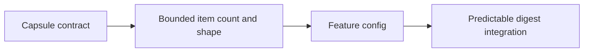

## item_081_day_captain_bounded_external_news_capsule_contract - Define the bounded external-news capsule contract for the daily digest
> From version: 1.8.0
> Status: Ready
> Understanding: 100%
> Confidence: 96%
> Progress: 0%
> Complexity: Medium
> Theme: UX
> Reminder: Update status/understanding/confidence/progress and linked task references when you edit this doc.

# Problem
- The daily digest currently has no external-context block, so the product cannot show a short outside-news recap without overloading the existing mail and meeting sections.
- The project needs a bounded contract for this capsule before provider integration or rendering work begins.
- Without an explicit contract, the feature can drift into a generic news feed or compete with the action-oriented purpose of the digest.

# Scope
- In:
  - define the digest-level contract for an external-news capsule separate from `Critical topics`, `Actions to take`, `Watch items`, `Daily presence`, and `Upcoming meetings`
  - define the bounded item shape for each news entry, such as headline, short recap, source name, and source URL
  - define the maximum item count and the no-render behavior when no usable items are available
  - define the configuration surface needed to enable, disable, or bound the feature
- Out:
  - choosing the final provider implementation details
  - detailed HTML/text styling beyond what is needed to make the capsule contract clear
  - broad personalization or mailbox-derived relevance logic

# Acceptance criteria
- AC1: The backlog defines a dedicated external-news capsule contract that is separate from the action-oriented digest sections.
- AC2: The capsule contract limits output to a small fixed number of short items.
- AC3: Each item contract includes source attribution and a source URL.
- AC4: The contract defines a clean omit/fallback path when the provider is disabled or returns no usable news.
- AC5: The contract is explicit enough to support later rendering, provider, and regression work without reopening the product shape.

# AC Traceability
- Req038 AC1 -> This item defines the separate external-news capsule contract. Proof: section separation is part of the item scope.
- Req038 AC2 -> This item defines the bounded item-count model. Proof: maximum item count is part of the contract.
- Req038 AC3 -> This item defines source attribution and source URL as required item fields. Proof: the item shape includes both.
- Req038 AC4 -> This item keeps the feature external-provider-only. Proof: mailbox-derived relevance is explicitly out of scope.
- Req038 AC5 -> This item defines the no-render fallback when provider output is unusable. Proof: omit behavior is part of the contract.
- Req038 AC6 -> This item bounds output size and avoids feed sprawl. Proof: bounded short items are part of the acceptance criteria.

# Links
- Request: `req_038_day_captain_external_news_capsule_in_daily_digest`
- Primary task(s): `task_043_day_captain_external_news_capsule_orchestration` (`Ready`)

# Priority
- Impact: Medium - a clean contract is the prerequisite for adding outside context without diluting the core digest.
- Urgency: Medium - the feature is additive, but the contract should be fixed before implementation starts.

# Notes
- Derived from `req_038_day_captain_external_news_capsule_in_daily_digest`.
- The preferred shape is a small external-context block, not a new primary action section.

