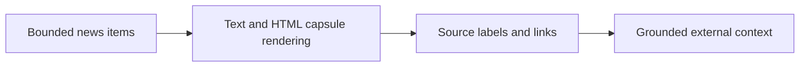

## item_082_day_captain_external_news_source_attribution_and_linked_rendering - Render source-backed external news entries with low-noise linked presentation
> From version: 1.8.0
> Status: Ready
> Understanding: 100%
> Confidence: 96%
> Progress: 0%
> Complexity: Medium
> Theme: UX
> Reminder: Update status/understanding/confidence/progress and linked task references when you edit this doc.

# Problem
- Even with a bounded contract, the external-news capsule can undermine trust if the rendered items do not visibly show where they come from.
- The digest needs a low-noise rendering treatment that makes the capsule clearly external, source-backed, and subordinate to the user’s own priorities.
- The product also needs consistent text and HTML presentation so the capsule remains legible across preview and delivered output.

# Scope
- In:
  - render the external-news capsule in both text and HTML output
  - keep source labels and source links visible per news item
  - keep the capsule visually separate from the current digest sections and close to other top-of-digest context blocks
  - keep the rendering concise enough that the capsule does not dominate the digest
- Out:
  - provider retries, timeout policy, or network isolation logic
  - long-form article excerpts or article-body rendering
  - ranking mail and meeting items against news items

# Acceptance criteria
- AC1: The digest renders a clearly labeled external-news capsule in both text and HTML output.
- AC2: Every rendered news item includes visible source attribution and a source URL or link target.
- AC3: The capsule remains visually and structurally separate from existing mail and meeting sections.
- AC4: The rendering stays low-noise and bounded rather than expanding into long-form article copy.
- AC5: Tests cover rendering order, source-label presence, and linked-output behavior.

# AC Traceability
- Req038 AC1 -> This item renders the capsule as a distinct digest block. Proof: separate placement is in scope.
- Req038 AC2 -> This item keeps the rendering bounded and low-noise. Proof: concise presentation is part of the acceptance criteria.
- Req038 AC3 -> This item requires visible source labels and links. Proof: attribution and linked rendering are the core of the item.
- Req038 AC7 -> This item requires rendering-order and attribution coverage. Proof: tests are explicit in the acceptance criteria.

# Links
- Request: `req_038_day_captain_external_news_capsule_in_daily_digest`
- Primary task(s): `task_043_day_captain_external_news_capsule_orchestration` (`Ready`)

# Priority
- Impact: High - source attribution and clear rendering are the trust-critical part of this feature.
- Urgency: Medium - the feature should not ship without a legible, grounded rendering contract.

# Notes
- Derived from `req_038_day_captain_external_news_capsule_in_daily_digest`.
- This item is intentionally about rendering trust, not provider fetch logic.

