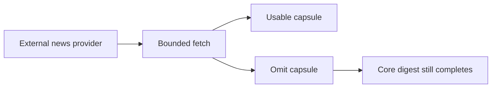

## item_083_day_captain_external_news_provider_fallback_and_runtime_isolation - Isolate external news provider failures from the core digest runtime
> From version: 1.8.0
> Status: Done
> Understanding: 100%
> Confidence: 95%
> Progress: 100%
> Complexity: Medium
> Theme: Reliability
> Reminder: Update status/understanding/confidence/progress and linked task references when you edit this doc.

# Problem
- An external-news capsule is useful only if provider slowness, emptiness, or malformed results cannot degrade the rest of the digest.
- The runtime needs bounded fetch behavior, timeout handling, and a clean omit path so the mailbox digest still completes normally when the news provider misbehaves.
- Without explicit isolation, an additive feature can become a new point of failure in the morning-digest path.

# Scope
- In:
  - integrate a bounded external provider fetch path for the capsule
  - define timeout, empty-result, and malformed-result fallback behavior
  - ensure the digest omits the capsule cleanly when provider output is unusable
  - keep the provider path bounded in latency and output size
  - add tests for runtime isolation and fallback behavior
- Out:
  - advanced provider failover across multiple news vendors
  - persistent caching or offline news archives unless required later
  - broad observability or analytics work outside the feature’s own runtime safety

# Acceptance criteria
- AC1: The external-news provider path is bounded by explicit timeout and output-size expectations.
- AC2: Provider disablement, emptiness, timeout, or malformed output causes the capsule to be omitted cleanly rather than breaking digest generation.
- AC3: The rest of the daily digest remains available even when the news provider fails.
- AC4: Tests cover representative provider failure and fallback scenarios.

# AC Traceability
- Req038 AC4 -> This item preserves the external-provider-only contract. Proof: provider integration is the core scope.
- Req038 AC5 -> This item defines omit-on-failure behavior. Proof: clean omission is an acceptance criterion.
- Req038 AC6 -> This item bounds latency and output size. Proof: runtime guardrails are part of the acceptance criteria.
- Req038 AC7 -> This item requires failure and fallback coverage. Proof: tests are explicit in the item itself.

# Links
- Request: `req_038_day_captain_external_news_capsule_in_daily_digest`
- Primary task(s): `task_043_day_captain_external_news_capsule_orchestration` (`Done`)

# Priority
- Impact: High - runtime isolation determines whether the feature is safe to add to the morning digest.
- Urgency: Medium - the feature should not proceed without this guardrail.

# Notes
- Derived from `req_038_day_captain_external_news_capsule_in_daily_digest`.
- The main intent is to keep external news additive and non-blocking.
