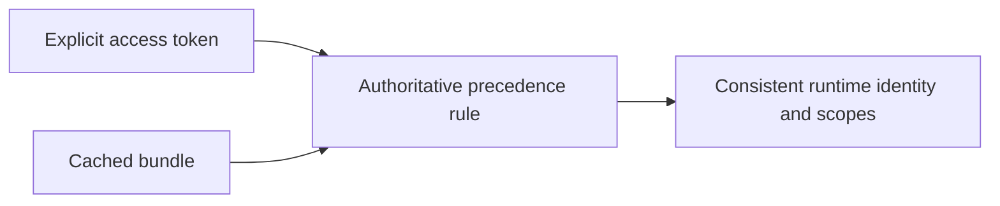

## item_086_day_captain_explicit_delegated_token_scope_and_identity_precedence - Make explicit delegated tokens authoritative over stale cache metadata
> From version: 1.8.0
> Status: Ready
> Understanding: 100%
> Confidence: 97%
> Progress: 0%
> Complexity: Medium
> Theme: Reliability
> Reminder: Update status/understanding/confidence/progress and linked task references when you edit this doc.

# Problem
- When an explicit delegated access token is provided, the runtime can still reuse cached user and scope metadata from an unrelated local bundle.
- That breaks operator expectations because the real token used at runtime and the reported identity/scope context can diverge.
- The result can be false `Mail.Send` prerequisite failures or incorrect user identity checks even when the provided token itself is valid.

# Scope
- In:
  - define precedence rules between explicit delegated tokens and cached delegated bundles
  - prevent stale cached user or scope metadata from overriding explicit token runtime behavior
  - keep the resulting scope and identity reporting explicit enough to reason about operationally
  - add regression coverage for explicit-token and stale-cache combinations
- Out:
  - introspecting arbitrary OAuth tokens in a new auth subsystem
  - redesigning the entire delegated token cache model
  - changing app-only auth semantics

# Acceptance criteria
- AC1: When an explicit delegated access token is provided, stale cached user metadata does not silently replace the runtime identity.
- AC2: When an explicit delegated access token is provided, stale cached scope metadata does not cause false capability checks such as missing `Mail.Send`.
- AC3: The precedence rule is explicit enough that operators can predict which token, identity, and scope source the runtime will trust.
- AC4: Tests cover representative explicit-token plus stale-cache combinations.

# AC Traceability
- Req039 AC4 -> This item fixes explicit-token versus stale-cache precedence. Proof: token/cache precedence is the full scope.
- Req039 AC5 -> This item keeps the precedence contract explainable. Proof: predictable runtime resolution is an acceptance criterion.
- Req039 AC6 -> This item requires explicit-token/stale-cache regression coverage. Proof: representative combinations are part of the tests.

# Links
- Request: `req_039_day_captain_delivery_recovery_and_delegated_auth_contract_corrections`
- Primary task(s): `task_044_day_captain_delivery_recovery_and_delegated_auth_contract_orchestration` (`Ready`)

# Priority
- Impact: Medium - this is a subtle bug, but it can cause hard-to-diagnose auth and delivery failures.
- Urgency: Medium - it should be fixed alongside the broader delegated-auth contract hardening.

# Notes
- Derived from `req_039_day_captain_delivery_recovery_and_delegated_auth_contract_corrections`.
- The intent is to stop stale cache metadata from shadowing a deliberately supplied runtime token.

