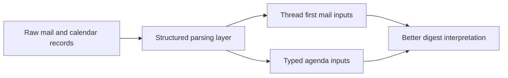

## item_087_day_captain_structured_mail_thread_and_agenda_parsing_foundations - Introduce structured mail-thread and agenda parsing foundations
> From version: 1.8.0
> Status: Ready
> Understanding: 97%
> Confidence: 94%
> Progress: 0%
> Complexity: High
> Theme: UX
> Reminder: Update status/understanding/confidence/progress and linked task references when you edit this doc.

# Problem
- Day Captain still moves too quickly from flat `MessageRecord` and `MeetingRecord` inputs to scored digest entries.
- That makes the mail path too message-oriented and the agenda path too late-typed for a product that should reason about threads, presence signals, and meeting context.
- Without a structured parsing foundation, the next generation of mail intelligence features will keep piling onto heuristics rather than building on stable intermediate meaning.

# Scope
- In:
  - introduce a structured parsing layer between Graph collection and digest prioritization
  - move surfaced mail interpretation toward thread-first digest inputs rather than mainly selected-message inputs
  - type agenda inputs earlier, including bounded distinction between ordinary meetings and all-day presence or location signals
  - preserve the current bounded product behavior while changing internal contracts
  - add regression coverage for the new parsing layer
- Out:
  - a full mailbox UI or historical conversation explorer
  - autonomous reply drafting or calendar mutation
  - broad redesign of unrelated delivery or auth runtime behavior

# Acceptance criteria
- AC1: Raw mail and meeting records are transformed into explicit digest-oriented intermediate inputs before final prioritization.
- AC2: Surfaced mail can be represented at thread level with bounded thread context and latest actionable state.
- AC3: Agenda parsing can distinguish qualifying all-day presence or location signals from ordinary meetings earlier in the pipeline.
- AC4: Tests cover representative thread-first and agenda-typing scenarios.

# AC Traceability
- Req040 AC1 -> This item creates the explicit structured parsing layer. Proof: raw records to typed digest inputs is the whole scope.
- Req040 AC2 -> This item moves surfaced mail toward thread-level representation. Proof: thread-first digestion is an acceptance criterion.
- Req040 AC3 -> This item adds earlier agenda typing. Proof: presence-versus-meeting classification is explicit in scope.
- Req040 AC7 -> This item requires regression coverage for the new parsing contract. Proof: tests are part of the item itself.

# Links
- Request: `req_040_day_captain_structured_mail_and_calendar_parsing_and_digest_presentation`
- Related request(s): `req_046_day_captain_typed_digest_contract_and_services_decomposition`
- Primary task(s): `task_045_day_captain_mail_intelligence_and_runtime_clarity_orchestration` (`Ready`)

# Priority
- Impact: High - this is the parsing foundation for several upcoming mail and agenda intelligence features.
- Urgency: Medium - current behavior works, but the existing structure is becoming a delivery bottleneck.

# Notes
- Derived primarily from `req_040_day_captain_structured_mail_and_calendar_parsing_and_digest_presentation`.
- This item should land before deeper ownership, trust, and cross-day memory features depend on richer intermediate contracts.
