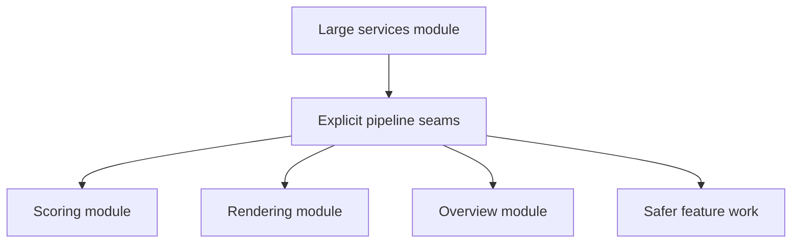

## item_089_day_captain_digest_services_decomposition_and_pipeline_seams - Decompose the digest services module along coherent pipeline seams
> From version: 1.8.0
> Status: Ready
> Understanding: 97%
> Confidence: 93%
> Progress: 0%
> Complexity: High
> Theme: Architecture
> Reminder: Update status/understanding/confidence/progress and linked task references when you edit this doc.

# Problem
- `services.py` concentrates too many digest responsibilities in one place: scoring, enrichment, confidence, recommendations, rendering, overview synthesis, and helper contracts.
- Even with strong tests, this concentration increases the chance that future changes will create hidden regressions or force unrelated features to evolve together.
- The codebase needs explicit seams so the digest pipeline can grow without one module becoming the mandatory edit point for every feature.

# Scope
- In:
  - identify coherent extraction seams in the digest pipeline
  - split oversized service responsibilities into smaller domain-oriented modules
  - keep entrypoint orchestration explicit while reducing module concentration
  - preserve current behavior with regression-safe extraction
  - document the new boundaries where useful
- Out:
  - rewriting the whole application in one pass
  - changing unrelated product behavior purely for style reasons
  - storage or auth redesign beyond what is needed to preserve extracted seams

# Acceptance criteria
- AC1: The digest pipeline is decomposed into smaller coherent modules instead of remaining concentrated in one oversized services file.
- AC2: Extracted boundaries reflect real responsibilities such as scoring, rendering, or overview behavior rather than arbitrary file splitting.
- AC3: Existing behavior remains regression-safe after extraction.
- AC4: Tests and docs cover the chosen seams and preserve confidence in the refactor.

# AC Traceability
- Req046 AC2 -> This item decomposes the oversized digest module into coherent seams. Proof: file and responsibility concentration is the full scope.
- Req046 AC4 -> This item keeps the refactor incremental and regression-safe. Proof: tests and documentation are part of the acceptance criteria.
- Req040 AC6 -> This item contributes to the incremental and backward-safe migration path. Proof: coherent seam extraction is explicitly scoped as regression-safe rather than a big-bang rewrite.

# Links
- Request: `req_046_day_captain_typed_digest_contract_and_services_decomposition`
- Related request(s): `req_040_day_captain_structured_mail_and_calendar_parsing_and_digest_presentation`
- Primary task(s): `task_045_day_captain_mail_intelligence_and_runtime_clarity_orchestration` (`Ready`)

# Priority
- Impact: High - structural concentration is the main architecture risk in the current codebase.
- Urgency: Medium - it should happen before the next wave of digest intelligence features compounds the problem.

# Notes
- Derived primarily from `req_046_day_captain_typed_digest_contract_and_services_decomposition`.
- This item is about maintainability and delivery safety, not just file-size aesthetics.
