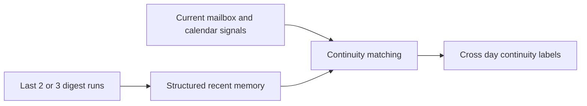

## item_090_day_captain_recent_digest_memory_and_cross_day_continuity_signals - Add recent digest memory and cross-day continuity signals
> From version: 1.8.0
> Status: Done
> Understanding: 98%
> Confidence: 95%
> Progress: 100%
> Complexity: Medium
> Theme: UX
> Reminder: Update status/understanding/confidence/progress and linked task references when you edit this doc.

# Problem
- Day Captain currently treats each daily brief too much like a fresh interpretation even when the same topic surfaced yesterday or remains unresolved.
- The project already stores digest runs, but that short-term history is not yet reused as structured cross-day memory for continuity signals.
- Without a bounded recent-memory layer, the digest cannot clearly say whether an item is new, persistent, changed, or cleared relative to the last few briefs.

# Scope
- In:
  - load the last 2 or 3 completed digest runs for the same tenant and user as bounded recent memory
  - derive structured continuity signals from prior digest data instead of reusing full previous prose
  - support bounded states such as already surfaced, still open, changed, or cleared
  - keep current mailbox and calendar data authoritative over prior digest memory
  - add regression coverage for recent-memory loading and matching behavior
- Out:
  - long-term memory across weeks or months
  - retrieval over arbitrary free-text digest bodies
  - generic timeline UI or historical workspace browsing

# Acceptance criteria
- AC1: The runtime can load a bounded recent-memory window of the last 2 or 3 digest runs for the same scoped tenant and user.
- AC2: Continuity behavior uses structured prior digest state rather than re-injecting full previous digest prose.
- AC3: Current surfaced items can receive bounded continuity labels such as already surfaced, still pending, changed, or cleared when safe matches exist.
- AC4: Current mailbox and calendar evidence remains authoritative over prior digest memory.
- AC5: Tests cover recent-memory window selection, matching behavior, and conservative fallback behavior.

# AC Traceability
- Req041 AC1 -> This item adds bounded recent-run loading. Proof: the memory window is an acceptance criterion.
- Req041 AC2 -> This item uses structured digest memory rather than full prose. Proof: the non-free-text contract is explicit in scope.
- Req041 AC3 -> This item adds bounded cross-day continuity signals. Proof: continuity labels are part of the acceptance criteria.
- Req041 AC4 -> This item preserves current-run authority over historical memory. Proof: source-of-truth behavior is explicit in scope.
- Req041 AC5 -> This item requires conservative fallback when no safe continuity match exists. Proof: safe fallback behavior is part of the bounded matching contract.
- Req041 AC6 -> This item keeps the memory layer bounded in depth, runtime cost, and output impact. Proof: short-term structured memory is explicitly scoped instead of unbounded historical replay.
- Req041 AC7 -> This item requires coverage for scoped loading and fallback rules. Proof: tests are part of the item itself.

# Links
- Request: `req_041_day_captain_recent_digest_memory_for_cross_day_context`
- Related request(s): `req_040_day_captain_structured_mail_and_calendar_parsing_and_digest_presentation`
- Primary task(s): `task_045_day_captain_mail_intelligence_and_runtime_clarity_orchestration` (`Done`)

# Priority
- Impact: High - bounded continuity can materially improve digest usefulness and trust.
- Urgency: Medium - it should follow enough structured parsing work to avoid building on fragile contracts.

# Notes
- Derived from `req_041_day_captain_recent_digest_memory_for_cross_day_context`.
- The preferred model is short-term structured memory, not summary-of-summary replay.
