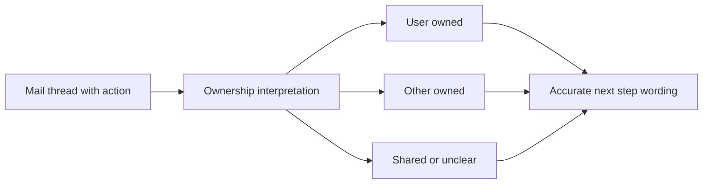

## item_091_day_captain_mail_action_ownership_and_non_owner_wording - Distinguish mail action ownership and avoid non-owner miswording
> From version: 1.8.0
> Status: Done
> Understanding: 98%
> Confidence: 95%
> Progress: 100%
> Complexity: Medium
> Theme: Product Quality
> Reminder: Update status/understanding/confidence/progress and linked task references when you edit this doc.

# Problem
- The digest can still confuse `this topic concerns the user` with `the user owns the next action`.
- That leads to wording and prioritization errors when another participant actually owns the requested next step.
- The trust gap is especially visible in threads where the user is copied, monitoring, relaying, or only contextually involved.

# Scope
- In:
  - add a bounded action-ownership interpretation layer for surfaced mail
  - distinguish relevance-to-user from action-expected-from-user
  - support bounded ownership outcomes such as user-owned, other-owned, shared, relay-only, and unclear
  - update wording and handling so non-owner items are not rendered as if the user must personally act
  - add regression coverage for representative owner and non-owner cases
- Out:
  - generic enterprise task management
  - autonomous delegation or reassignment
  - broad UI redesign outside ownership semantics

# Acceptance criteria
- AC1: The digest distinguishes between relevance to the target user and action expected from the target user.
- AC2: When another participant appears to own the next action, the digest does not render the item as if the target user is personally expected to act.
- AC3: Bounded ownership states such as user-owned, other-owned, shared, relay-only, or unclear are supported with conservative fallback.
- AC4: Recommended action wording remains aligned with ownership.
- AC5: Tests cover representative owner, non-owner, relay, and ambiguous thread cases.

# AC Traceability
- Req042 AC1 -> This item separates relevance from action ownership. Proof: that distinction is the core scope.
- Req042 AC2 -> This item prevents non-owner miswording. Proof: non-owner rendering is an acceptance criterion.
- Req042 AC3 -> This item supports bounded ownership outcomes with conservative fallback. Proof: the ownership states are explicit in scope.
- Req042 AC4 -> This item keeps section and wording behavior aligned with ownership. Proof: ownership-aware recommendations are part of the acceptance criteria.
- Req042 AC6 -> This item requires representative owner and non-owner coverage. Proof: tests are explicit in the item itself.

# Links
- Request: `req_042_day_captain_mail_action_ownership_and_non_owner_handling`
- Related request(s): `req_040_day_captain_structured_mail_and_calendar_parsing_and_digest_presentation`
- Primary task(s): `task_045_day_captain_mail_intelligence_and_runtime_clarity_orchestration` (`Done`)

# Priority
- Impact: High - incorrect ownership attribution directly harms digest trust.
- Urgency: High - the issue is already visible in real digest interpretation.

# Notes
- Derived from `req_042_day_captain_mail_action_ownership_and_non_owner_handling`.
- The preferred behavior is conservative: uncertain ownership should weaken wording rather than overstate it.
