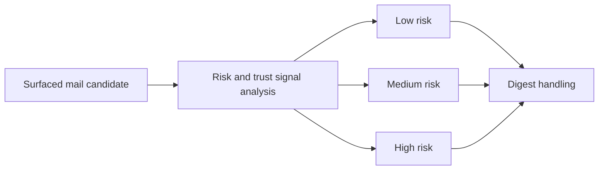

## item_092_day_captain_mail_suspicion_risk_signals_and_conservative_rendering - Add suspicious-mail risk signals and conservative digest handling
> From version: 1.8.0
> Status: Done
> Understanding: 98%
> Confidence: 95%
> Progress: 100%
> Complexity: Medium
> Theme: Security
> Reminder: Update status/understanding/confidence/progress and linked task references when you edit this doc.

# Problem
- Day Captain can currently summarize a mail fluently even when sender, intent, or request pattern looks suspicious.
- The digest lacks a bounded anti-scam and anti-phishing trust model, so suspicious mails may still receive normal operational wording and confidence posture.
- The product needs risk-aware handling, not a false binary claim that a message is definitively safe or malicious.

# Scope
- In:
  - add bounded suspicious-mail risk signals for surfaced or borderline mail candidates
  - support explicit risk levels and reasons rather than a binary safe or unsafe verdict
  - let suspicious risk influence digest wording, confidence, badges, or placement conservatively
  - provide practical handling guidance such as verify before acting
  - add coverage for suspicious, trustworthy, and ambiguous cases
- Out:
  - full secure-email gateway behavior
  - quarantine, deletion, or mailbox mutation
  - definitive legal or enterprise-grade security certification

# Acceptance criteria
- AC1: Surfaced or borderline mail candidates can receive explicit suspicious-mail risk signals.
- AC2: The signal exposes explainable output such as risk level, risk reasons, trust signals, or handling recommendation rather than a binary reliable verdict.
- AC3: Medium or high risk changes digest posture conservatively through wording, confidence, placement, or visible caution signal.
- AC4: Ambiguous evidence falls back conservatively without overstating either safety or malice.
- AC5: Tests cover suspicious, trustworthy, and ambiguous representative cases.

# AC Traceability
- Req043 AC1 -> This item adds bounded suspicious-mail risk signals. Proof: risk signaling is the core scope.
- Req043 AC2 -> This item keeps the output explainable rather than binary. Proof: risk reasons and trust signals are an acceptance criterion.
- Req043 AC3 -> This item makes digest handling more conservative for elevated-risk mail. Proof: changed trust posture is explicit in scope.
- Req043 AC4 -> This item adds visible caution signals. Proof: rendering of suspicious or verify-before-acting behavior is part of the acceptance criteria.
- Req043 AC5 -> This item preserves conservative fallback under ambiguity. Proof: fallback is an acceptance criterion.
- Req043 AC6 -> This item keeps the suspicious-mail analysis bounded in cost and scope. Proof: the feature is explicitly framed as bounded, explainable, and routine-digest-safe rather than a full security platform.
- Req043 AC7 -> This item requires representative coverage. Proof: tests are part of the item itself.

# Links
- Request: `req_043_day_captain_mail_anti_scam_and_phishing_risk_signals`
- Related request(s): `req_040_day_captain_structured_mail_and_calendar_parsing_and_digest_presentation`
- Primary task(s): `task_045_day_captain_mail_intelligence_and_runtime_clarity_orchestration` (`Done`)

# Priority
- Impact: High - suspicious mails summarized as normal work can materially reduce trust in the assistant.
- Urgency: Medium - this should follow the mail-interpretation foundations but is product-relevant now.

# Notes
- Derived from `req_043_day_captain_mail_anti_scam_and_phishing_risk_signals`.
- The preferred framing is risk-based and explainable, not a binary safety badge.
