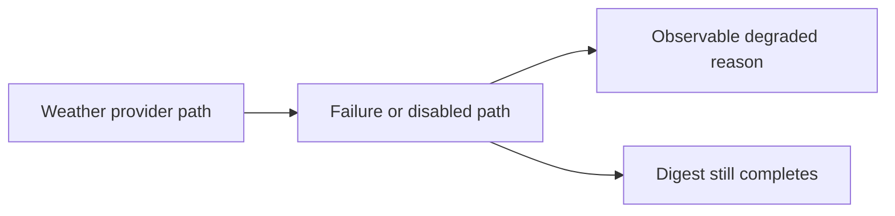

## item_093_day_captain_weather_degraded_path_observability - Make weather degraded-path behavior observable without breaking digests
> From version: 1.8.0
> Status: Ready
> Understanding: 99%
> Confidence: 97%
> Progress: 0%
> Complexity: Low
> Theme: Observability
> Reminder: Update status/understanding/confidence/progress and linked task references when you edit this doc.

# Problem
- The weather capsule degrades gracefully today, but failures are too silent to diagnose in practice.
- When weather disappears from the digest, operators cannot easily tell whether the reason was configuration, provider failure, or payload drift.
- The project needs observability on the degraded weather path without turning weather into a fatal dependency.

# Scope
- In:
  - add bounded observability to the weather degraded path
  - preserve successful digest generation when weather retrieval fails
  - distinguish disabled weather from failed weather retrieval where useful
  - add coverage for representative degraded scenarios
- Out:
  - weather product redesign
  - making weather mandatory
  - broad logging redesign beyond the weather path

# Acceptance criteria
- AC1: Weather retrieval failures no longer disappear silently.
- AC2: Digest generation still succeeds when weather retrieval fails.
- AC3: Disabled weather and failed weather retrieval remain meaningfully distinguishable where that matters operationally.
- AC4: Tests cover representative degraded weather scenarios and the chosen observability behavior.

# AC Traceability
- Req047 AC1 -> This item adds observability to the degraded path. Proof: missing silent failures is the core scope.
- Req047 AC2 -> This item preserves graceful fallback. Proof: digest completion remains an acceptance criterion.
- Req047 AC3 -> This item distinguishes disabled from failed weather when operationally useful. Proof: that distinction is explicit in scope.
- Req047 AC4 -> This item requires degraded-path coverage. Proof: tests are an acceptance criterion.

# Links
- Request: `req_047_day_captain_weather_failure_observability_and_degraded_path_logging`
- Primary task(s): `task_045_day_captain_mail_intelligence_and_runtime_clarity_orchestration` (`Ready`)

# Priority
- Impact: Medium - missing observability weakens diagnosability more than end-user product behavior.
- Urgency: Medium - low-cost quality improvement for production operations.

# Notes
- Derived from `req_047_day_captain_weather_failure_observability_and_degraded_path_logging`.
- The preferred behavior is non-fatal but visible.
