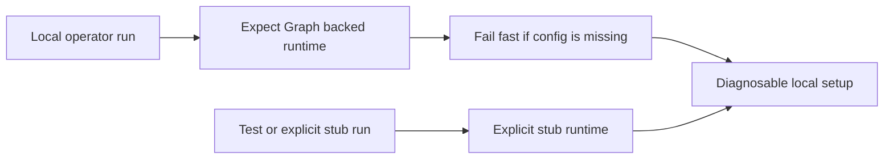

## item_094_day_captain_local_graph_fail_fast_and_explicit_stub_runtime_contract - Make local Graph-backed runs fail fast and keep stub runtime explicit
> From version: 1.8.0
> Status: Ready
> Understanding: 98%
> Confidence: 95%
> Progress: 0%
> Complexity: Medium
> Theme: Reliability
> Reminder: Update status/understanding/confidence/progress and linked task references when you edit this doc.

# Problem
- Local application assembly can still fall back to stub auth and static collectors in cases where an operator expected a real Graph-backed run.
- That can produce misleading local success with empty or unrealistic output instead of surfacing the true misconfiguration.
- Tests benefit from explicit stubs, but accidental runtime fallback should not masquerade as a healthy local setup.

# Scope
- In:
  - make local Graph-expected runs fail explicitly when required real Graph setup is missing
  - preserve intentional stub behavior for tests or explicitly stubbed scenarios
  - clarify how stub runtime is entered so accidental fallback becomes less likely
  - add tests and docs for local fail-fast versus explicit stub usage
- Out:
  - hosted validation redesign
  - removal of all test doubles
  - broad CLI redesign unrelated to runtime contract clarity

# Acceptance criteria
- AC1: When a local run is clearly intended to use Graph but required config is missing, runtime assembly fails explicitly instead of quietly degrading to stubs.
- AC2: Explicit stub behavior remains available for tests and intentional stubbed scenarios.
- AC3: The contract for entering stubbed execution is explicit enough that accidental fallback is materially reduced.
- AC4: Tests and docs cover the local fail-fast contract and the preserved explicit stub path.

# AC Traceability
- Req048 AC1 -> This item makes Graph-expected local runs fail fast. Proof: fail-fast local runtime is the core scope.
- Req048 AC2 -> This item preserves explicit stubs for tests. Proof: preserved stub behavior is an acceptance criterion.
- Req048 AC3 -> This item makes stub entry explicit. Proof: accidental fallback reduction is explicit in scope.
- Req048 AC4 -> This item requires tests and docs for both paths. Proof: validation coverage is an acceptance criterion.

# Links
- Request: `req_048_day_captain_explicit_local_fail_fast_instead_of_stub_runtime_fallback`
- Related request(s): `req_034_day_captain_hosted_runtime_fail_fast_and_identity_normalization`
- Primary task(s): `task_045_day_captain_mail_intelligence_and_runtime_clarity_orchestration` (`Ready`)

# Priority
- Impact: Medium - this is mainly a local operator-trust and diagnosability issue.
- Urgency: Medium - it should be fixed before local workflows drift further into ambiguous runtime behavior.

# Notes
- Derived from `req_048_day_captain_explicit_local_fail_fast_instead_of_stub_runtime_fallback`.
- This item keeps the testability benefits of explicit stubs while reducing accidental local ambiguity.
