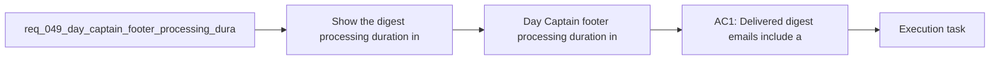

## item_095_day_captain_footer_processing_duration_in_delivered_digest_emails - Day Captain footer processing duration in delivered digest emails
> From version: 1.8.0
> Schema version: 1.0
> Status: Done
> Understanding: 98%
> Confidence: 95%
> Progress: 100%
> Complexity: Low
> Theme: Delivery
> Reminder: Update status/understanding/confidence/progress and linked task references when you edit this doc.

# Problem
- Show the digest processing duration in the delivered email footer.
- Display that duration directly under `Day Captain © 2026` so the operator can see how long the current digest took to generate.
- Make the displayed duration reflect the digest generation pipeline itself, not the downstream email transport latency.
- - The delivered digest already ends with a small footer block that includes the project signature line `Day Captain © 2026`.
- - That footer is a natural place for lightweight operator-facing runtime metadata.

# Scope
- In:
- Out:

# Acceptance criteria
- AC1: Delivered digest emails include a processing-duration line directly below `Day Captain © 2026` in the footer.
- AC2: The displayed value reflects the current digest generation duration, measured from run start until the delivery content is ready, and does not depend on downstream mailbox delivery latency.
- AC3: Both text and HTML rendering paths display the same duration information in a readable operator-facing format.
- AC4: If timing metadata is unavailable, the digest still renders safely without breaking footer layout or delivery.
- AC5: Tests cover timing capture/propagation and footer rendering.

# AC Traceability
- AC1 -> Scope: Delivered digest emails include a processing-duration line directly below `Day Captain © 2026` in the footer.. Proof: implemented in [services.py](/Users/alexandreagostini/Documents/day-captain/src/day_captain/services.py) and covered by [test_digest_renderer.py](/Users/alexandreagostini/Documents/day-captain/tests/test_digest_renderer.py).
- AC2 -> Scope: The displayed value reflects the current digest generation duration, measured from run start until the delivery content is ready, and does not depend on downstream mailbox delivery latency.. Proof: bounded timing capture now starts in [app.py](/Users/alexandreagostini/Documents/day-captain/src/day_captain/app.py) before collection/auth work and is injected before delivery.
- AC3 -> Scope: Both text and HTML rendering paths display the same duration information in a readable operator-facing format.. Proof: the footer line is rendered in both body and HTML in [services.py](/Users/alexandreagostini/Documents/day-captain/src/day_captain/services.py) and verified in [test_digest_renderer.py](/Users/alexandreagostini/Documents/day-captain/tests/test_digest_renderer.py).
- AC4 -> Scope: If timing metadata is unavailable, the digest still renders safely without breaking footer layout or delivery.. Proof: the renderer keeps the duration optional and only renders the line when a value is present in [services.py](/Users/alexandreagostini/Documents/day-captain/src/day_captain/services.py).
- AC5 -> Scope: Tests cover timing capture/propagation and footer rendering.. Proof: covered by [test_app.py](/Users/alexandreagostini/Documents/day-captain/tests/test_app.py) and [test_digest_renderer.py](/Users/alexandreagostini/Documents/day-captain/tests/test_digest_renderer.py).

# Decision framing
- Product framing: Not needed
- Product signals: (none detected)
- Product follow-up: No product brief follow-up is expected based on current signals.
- Architecture framing: Not needed
- Architecture signals: Small renderer and payload propagation change.
- Architecture follow-up: No ADR is expected unless the timing contract expands beyond this bounded footer feature.

# Links
- Product brief(s): (none yet)
- Architecture decision(s): (none yet)
- Request: `req_049_day_captain_footer_processing_duration_in_delivered_digest_emails`
- Primary task(s): `task_046_day_captain_footer_timing_and_meeting_open_link_orchestration`

# AI Context
- Summary: Show the current digest generation duration below the Day Captain footer signature without conflating it with email transport...
- Keywords: footer duration, digest generation timing, email footer metadata, processing time, delivery footer
- Use when: The work is about exposing current-run generation time inside the delivered digest footer.
- Skip when: The work is about broader performance instrumentation, dashboards, or transport latency measurement.

# References
- `Footer rendering: [services.py](/Users/alexandreagostini/Documents/day-captain/src/day_captain/services.py)`
- `Application orchestration and run lifecycle: [app.py](/Users/alexandreagostini/Documents/day-captain/src/day_captain/app.py)`
- `logics/skills/logics-ui-steering/SKILL.md`

# Priority
- Impact:
- Urgency:

# Notes
- Derived from request `req_049_day_captain_footer_processing_duration_in_delivered_digest_emails`.
- Source file: `logics/request/req_049_day_captain_footer_processing_duration_in_delivered_digest_emails.md`.
- Request context seeded into this backlog item from `logics/request/req_049_day_captain_footer_processing_duration_in_delivered_digest_emails.md`.
- Completed on Saturday, March 28, 2026 through `task_046_day_captain_footer_timing_and_meeting_open_link_orchestration`.
