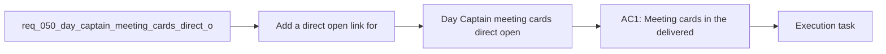

## item_096_day_captain_meeting_cards_direct_open_link_in_digest - Day Captain meeting cards direct open link in digest
> From version: 1.8.0
> Schema version: 1.0
> Status: Done
> Understanding: 98%
> Confidence: 95%
> Progress: 100%
> Complexity: Low
> Theme: Delivery
> Reminder: Update status/understanding/confidence/progress and linked task references when you edit this doc.

# Problem
- Add a direct open link for calendar meetings in the digest, similarly to the open link already shown for emails.
- Make upcoming meeting cards actionable so the operator can jump from the digest to the calendar event in one click.
- Preserve safe rendering when a meeting does not expose a usable calendar URL.
- - Digest message entries already expose a direct open affordance such as `Ouvrir dans Outlook`.
- - Meeting entries already carry source URLs in the pipeline, but the rendering contract should make that action explicit and consistent for calendar items too.

# Scope
- In:
- Out:

# Acceptance criteria
- AC1: Meeting cards in the delivered digest expose a direct open action when a usable calendar source URL is available.
- AC2: The action is rendered in both text and HTML digests with wording consistent with the existing mail open-link affordance.
- AC3: When no reliable meeting URL is available, the digest omits the action gracefully without broken placeholders or malformed layout.
- AC4: Tests cover both the positive path and the no-URL fallback path.

# AC Traceability
- AC1 -> Scope: Meeting cards in the delivered digest expose a direct open action when a usable calendar source URL is available.. Proof: implemented in [services.py](/Users/alexandreagostini/Documents/day-captain/src/day_captain/services.py) and covered by the existing positive-path renderer tests in [test_digest_renderer.py](/Users/alexandreagostini/Documents/day-captain/tests/test_digest_renderer.py).
- AC2 -> Scope: The action is rendered in both text and HTML digests with wording consistent with the existing mail open-link affordance.. Proof: the renderer uses the same `item_actions` contract for mail and meeting items in [services.py](/Users/alexandreagostini/Documents/day-captain/src/day_captain/services.py).
- AC3 -> Scope: When no reliable meeting URL is available, the digest omits the action gracefully without broken placeholders or malformed layout.. Proof: explicit no-link fallback coverage was added in [test_digest_renderer.py](/Users/alexandreagostini/Documents/day-captain/tests/test_digest_renderer.py).
- AC4 -> Scope: Tests cover both the positive path and the no-URL fallback path.. Proof: covered in [test_digest_renderer.py](/Users/alexandreagostini/Documents/day-captain/tests/test_digest_renderer.py).

# Decision framing
- Product framing: Not needed
- Product signals: navigation and discoverability
- Product follow-up: No separate product brief is needed for this bounded delivery refinement.
- Architecture framing: Not needed
- Architecture signals: Small renderer-only action exposure using existing meeting source URLs.
- Architecture follow-up: No ADR is expected unless the meeting navigation contract broadens beyond this simple open action.

# Links
- Product brief(s): (none yet)
- Architecture decision(s): (none yet)
- Request: `req_050_day_captain_meeting_cards_direct_open_link_in_digest`
- Primary task(s): `task_046_day_captain_footer_timing_and_meeting_open_link_orchestration`

# AI Context
- Summary: Add a direct calendar open link to digest meeting cards, aligned with the existing open-link affordance already used...
- Keywords: meeting open link, calendar event link, digest meeting card, outlook calendar open action, renderer consistency
- Use when: The work is about making meeting cards directly openable from the delivered digest.
- Skip when: The work is about online join links, RSVP workflows, or broader digest redesign.

# References
- `Digest renderer and meeting card output: [services.py](/Users/alexandreagostini/Documents/day-captain/src/day_captain/services.py)`
- `Digest payload and entry contract: [models.py](/Users/alexandreagostini/Documents/day-captain/src/day_captain/models.py)`
- `logics/skills/logics-ui-steering/SKILL.md`

# Priority
- Impact:
- Urgency:

# Notes
- Derived from request `req_050_day_captain_meeting_cards_direct_open_link_in_digest`.
- Source file: `logics/request/req_050_day_captain_meeting_cards_direct_open_link_in_digest.md`.
- Request context seeded into this backlog item from `logics/request/req_050_day_captain_meeting_cards_direct_open_link_in_digest.md`.
- Completed on Saturday, March 28, 2026 through `task_046_day_captain_footer_timing_and_meeting_open_link_orchestration`, with explicit fallback coverage added for meetings without source links.
