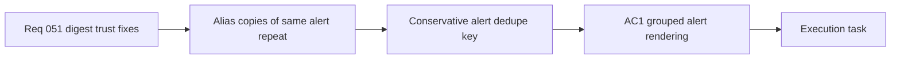

## item_097_day_captain_alias_level_operational_alert_dedupe - Day Captain alias level operational alert dedupe
> From version: 1.9.0  
> Schema version: 1.0
> Status: Done
> Understanding: 100%
> Confidence: 98%
> Progress: 100%
> Complexity: Medium
> Theme: Product Quality
> Reminder: Update status/understanding/confidence/progress and linked task references when you edit this doc.

# Problem
- Near-identical operational alerts delivered to several aliases currently surface as separate digest entries because grouping mostly relies on `thread_id`.
- This creates noisy repetition in `Points critiques` / `Critical topics` even when all copies describe the same operational incident.
- The dedupe contract must stay conservative: collapsing duplicates should not merge distinct incidents that happen close together.

# Scope
- In:
  - define a bounded canonical key for alias-level alert grouping using normalized subject, sender, preview fingerprint, and short time proximity
  - render one coherent digest item when several aliases receive the same operational alert
  - preserve the ability to surface truly distinct alerts separately
  - add regression coverage for duplicate and non-duplicate cases
- Out:
  - placeholder meeting filtering
  - action-section routing changes for informational mail
  - broad mailbox deduplication outside the operational-alert use case

# Acceptance criteria
- AC1: Near-identical operational alerts delivered to multiple aliases are collapsed into a single digest representation or explicit grouped item instead of appearing as repeated standalone entries.
- AC2: The dedupe logic does not merge materially distinct alerts when sender, normalized subject, preview fingerprint, or delivery timing indicate separate incidents.
- AC3: Explicitly actionable or transactional alerts still surface after grouping, with no loss of the core incident signal.
- AC4: Tests cover grouped alias duplicates, non-merge safeguards, and preserved visibility for valid operational alerts.

# AC Traceability
- Req051 AC1 -> AC1. Proof: this item owns the alias-level grouping behavior visible in the digest.
- Req051 AC2 -> AC2. Proof: conservative non-merge rules belong to the dedupe contract.
- Req051 AC5 -> AC3. Proof: grouped alerts must remain visible as actionable operational incidents.
- Req051 AC6 -> AC4. Proof: the item closes only with duplicate and non-duplicate regression coverage.

# Decision framing
- Product framing: Not needed
- Product signals: bounded digest ranking adjustment already fully framed by the request and backlog item.
- Product follow-up: No separate product brief is needed unless the grouping behavior expands into a broader inbox taxonomy.
- Architecture framing: Not needed
- Architecture signals: conservative grouping logic remains local to the existing scoring pipeline.
- Architecture follow-up: No ADR is expected unless the dedupe key evolves into a reusable cross-source identity contract.

# Links
- Product brief(s): (none yet)
- Architecture decision(s): (none yet)
- Request: `req_051_day_captain_digest_alias_dedupe_placeholder_meeting_filtering_and_action_signal_tightening`
- Primary task(s): `task_047_day_captain_remaining_digest_trust_fixes_orchestration`

# AI Context
- Summary: Reduce remaining digest trust issues by deduplicating alias copies of the same alert, filtering placeholder meetings, and requiring...
- Keywords: digest dedupe, alias grouping, placeholder meeting, action gate, operational alert, false action, meeting filter
- Use when: Use when the work is about reducing duplicate alerts, removing placeholder calendar noise, or tightening action promotion in the Day Captain digest.
- Skip when: Skip when the work is only about news configuration, broad spam handling, or unrelated delivery features.

# References
- Digest scoring and grouping logic: [services.py](/Users/alexandreagostini/Documents/day-captain/src/day_captain/services.py)

# Priority
- Impact: High - duplicate critical alerts directly reduce trust and waste the limited attention budget of the digest.
- Urgency: High - the issue is already visible after the transactional-alert fix and will keep repeating until grouped.

# Notes
- Derived from request `req_051_day_captain_digest_alias_dedupe_placeholder_meeting_filtering_and_action_signal_tightening`.
- Source file: `logics/request/req_051_day_captain_digest_alias_dedupe_placeholder_meeting_filtering_and_action_signal_tightening.md`.
- Request context seeded into this backlog item from `logics/request/req_051_day_captain_digest_alias_dedupe_placeholder_meeting_filtering_and_action_signal_tightening.md`.
- Closed on Saturday, March 28, 2026 through `task_047_day_captain_remaining_digest_trust_fixes_orchestration` after adding conservative alias-level operational alert grouping with non-merge safeguards.
