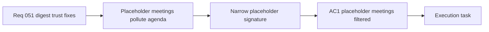

## item_098_day_captain_placeholder_meeting_filtering_and_compact_rendering - Day Captain placeholder meeting filtering and compact rendering
> From version: 1.9.0  
> Schema version: 1.0
> Status: Ready
> Understanding: 99%
> Confidence: 97%
> Progress: 5%
> Complexity: Medium
> Theme: Product Quality
> Reminder: Update status/understanding/confidence/progress and linked task references when you edit this doc.

# Problem
- The upcoming meetings section can still show holding slots or placeholder events as if they were real meetings worth briefing.
- These entries are characterized by bounded signals such as zero attendees, self-organization, and placeholder calendar body text.
- The digest should suppress or compact this noise without hiding legitimate private work blocks that do not match the placeholder signature.

# Scope
- In:
  - define a narrow placeholder-meeting signature using explicit metadata and preview patterns
  - exclude or compact placeholder meetings so they do not render as normal upcoming briefings
  - avoid misleading confidence levels when a placeholder event is retained
  - add regression coverage for placeholder and non-placeholder meetings
- Out:
  - alias-level duplicate alert grouping
  - general meeting redesign beyond the minimum compact or hidden rendering
  - action gating for informational mail

# Acceptance criteria
- AC1: Placeholder or holding-slot meetings matching the bounded placeholder signature do not appear as normal upcoming meeting briefings; if retained at all, they are rendered with lower prominence.
- AC2: Meetings that do not match the full placeholder signature continue to surface normally, including legitimate private work blocks or standard meetings without attendees.
- AC3: Retained placeholder events do not receive misleadingly high confidence based only on placeholder body content.
- AC4: Tests cover placeholder-meeting filtering, compact fallback behavior, confidence handling, and non-placeholder safety cases.

# AC Traceability
- Req051 AC3 -> AC1 and AC3. Proof: this item owns placeholder filtering and the no-misleading-confidence contract.
- Req051 AC6 -> AC4. Proof: closure requires explicit placeholder and non-placeholder regression coverage.

# Decision framing
- Product framing: Not needed
- Product signals: placeholder filtering is a bounded relevance correction inside the existing meeting briefing surface.
- Product follow-up: No separate product brief is needed unless the work expands into a broader meeting taxonomy or planner behavior.
- Architecture framing: Not needed
- Architecture signals: the change stays within current meeting metadata and scoring heuristics.
- Architecture follow-up: No ADR is expected unless placeholder detection becomes a reusable calendar-normalization subsystem.

# Links
- Product brief(s): (none yet)
- Architecture decision(s): (none yet)
- Request: `req_051_day_captain_digest_alias_dedupe_placeholder_meeting_filtering_and_action_signal_tightening`
- Primary task(s): `task_047_day_captain_remaining_digest_trust_fixes_orchestration`

# AI Context
- Summary: Reduce remaining digest trust issues by deduplicating alias copies of the same alert, filtering placeholder meetings, and requiring...
- Keywords: digest dedupe, alias grouping, placeholder meeting, action gate, operational alert, false action, meeting filter
- Use when: Use when the work is about reducing duplicate alerts, removing placeholder calendar noise, or tightening action promotion in the Day Captain digest.
- Skip when: Skip when the work is only about news configuration, broad spam handling, or unrelated delivery features.

# References
- Meeting scoring and rendering logic: [services.py](/Users/alexandreagostini/Documents/day-captain/src/day_captain/services.py)
- Meeting collection entrypoint: [app.py](/Users/alexandreagostini/Documents/day-captain/src/day_captain/app.py)

# Priority
- Impact: Medium - placeholder meetings pollute the agenda and reduce confidence in the briefing.
- Urgency: High - the issue is already visible in live digests and undermines meeting relevance.

# Notes
- Derived from request `req_051_day_captain_digest_alias_dedupe_placeholder_meeting_filtering_and_action_signal_tightening`.
- Source file: `logics/request/req_051_day_captain_digest_alias_dedupe_placeholder_meeting_filtering_and_action_signal_tightening.md`.
- Request context seeded into this backlog item from `logics/request/req_051_day_captain_digest_alias_dedupe_placeholder_meeting_filtering_and_action_signal_tightening.md`.
