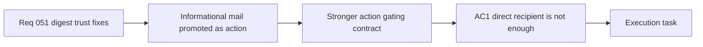

## item_099_day_captain_stronger_action_gating_for_informational_mail - Day Captain stronger action gating for informational mail
> From version: 1.9.0
> Schema version: 1.0
> Status: Ready
> Understanding: 98%
> Confidence: 96%
> Progress: 0%
> Complexity: Medium
> Theme: Product Quality
> Reminder: Update status/understanding/confidence/progress and linked task references when you edit this doc.

# Problem
- The current scoring model still gives enough weight to direct-recipient presence that some low-value informational mail can surface in `Actions to take` / `Actions a mener`.
- This makes the digest look more urgent than it really is and hides the truly actionable items behind coordination noise.
- The routing contract should require stronger action evidence than simply being in the `To` field, while preserving visibility for genuine operational or transactional alerts.

# Scope
- In:
  - tighten section routing so direct-recipient presence alone does not promote a mail into the action section
  - define the stronger action signals that still justify `Actions to take` placement
  - route weaker informational mail to a lower-prominence section or exclude it when appropriate
  - add regression coverage for demotion and preserved-action cases
- Out:
  - duplicate alert grouping
  - placeholder meeting filtering
  - mailbox-wide importance modeling beyond digest section routing

# Acceptance criteria
- AC1: Direct-recipient status alone is no longer sufficient to place informational mail into `Actions to take` / `Actions a mener`; a stronger action-oriented signal is required.
- AC2: Lower-signal informational mail is demoted to a lower-prominence section or excluded instead of being rendered as a user action.
- AC3: Explicitly actionable or transactional alerts still surface correctly after the action-gate tightening.
- AC4: Tests cover demoted informational mail, preserved actionable mail, and deterministic fallback behavior.

# AC Traceability
- Req051 AC4 -> AC1 and AC2. Proof: this item owns the stricter routing contract and the demotion of low-value informational mail.
- Req051 AC5 -> AC3. Proof: the action gate must remain safe for real operational and transactional alerts.
- Req051 AC6 -> AC4. Proof: regression coverage is required for both demotion and preserved-action cases.

# Decision framing
- Product framing: Required
- Product signals: user segmentation, navigation and discoverability, engagement loop
- Product follow-up: Create or link a product brief before implementation moves deeper into delivery.
- Architecture framing: Required
- Architecture signals: data model and persistence, contracts and integration, state and sync
- Architecture follow-up: Create or link an architecture decision before irreversible implementation work starts.

# Links
- Product brief(s): (none yet)
- Architecture decision(s): (none yet)
- Request: `req_051_day_captain_digest_alias_dedupe_placeholder_meeting_filtering_and_action_signal_tightening`
- Primary task(s): (none yet)

# AI Context
- Summary: Reduce remaining digest trust issues by deduplicating alias copies of the same alert, filtering placeholder meetings, and requiring...
- Keywords: digest dedupe, alias grouping, placeholder meeting, action gate, operational alert, false action, meeting filter
- Use when: Use when the work is about reducing duplicate alerts, removing placeholder calendar noise, or tightening action promotion in the Day Captain digest.
- Skip when: Skip when the work is only about news configuration, broad spam handling, or unrelated delivery features.

# References
- Digest scoring and section routing logic: [services.py](/Users/alexandreagostini/Documents/day-captain/src/day_captain/services.py)

# Priority
- Impact: High - false-positive actions directly distort the operator's priorities inside the digest.
- Urgency: High - the issue is already visible in live usage and competes with real actions.

# Notes
- Derived from request `req_051_day_captain_digest_alias_dedupe_placeholder_meeting_filtering_and_action_signal_tightening`.
- Source file: `logics/request/req_051_day_captain_digest_alias_dedupe_placeholder_meeting_filtering_and_action_signal_tightening.md`.
- Request context seeded into this backlog item from `logics/request/req_051_day_captain_digest_alias_dedupe_placeholder_meeting_filtering_and_action_signal_tightening.md`.
