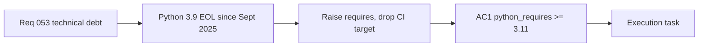

## item_100_day_captain_python_3_9_eol_migration_to_3_11 - Day Captain Python 3.9 EOL migration to 3.11
> From version: 1.9.3
> Schema version: 1.0
> Status: Done
> Understanding: 100
> Confidence: 98
> Progress: 100%
> Complexity: Low
> Theme: Engineering Quality
> Reminder: Update status/understanding/confidence/progress and linked task references when you edit this doc.

# Problem
- Python 3.9 reached end-of-life in September 2025 and no longer receives security patches.
- The CI matrix still tests against 3.9, giving false confidence that the codebase works on an unsupported interpreter.
- `pyproject.toml` does not declare a lower bound tight enough to prevent installation on 3.9.
- Running production workloads on an EOL interpreter is a growing operational risk.

# Scope
- In:
  - raise `python_requires` to `>=3.11` in `pyproject.toml`
  - remove Python 3.9 from the CI matrix in `.github/workflows/ci.yml`
  - verify no 3.9-only compatibility shims remain (e.g. manual `Union[]` types where `X | Y` is available)
  - confirm CI passes cleanly on 3.11 and 3.12 (add 3.12 to matrix if not already present)
- Out:
  - adopting new 3.11+ syntax features beyond removing compatibility shims
  - changing any application logic

# Acceptance criteria
- AC1: `pyproject.toml` declares `python_requires >= "3.11"`.
- AC2: CI matrix no longer includes Python 3.9; it includes at least 3.11.
- AC3: All tests pass on the updated CI matrix with no skips or xfails introduced by this change.
- AC4: No Python 3.9-only compatibility shim remains without a justifying comment.

# AC Traceability
- Req053 AC1 → AC1 and AC2. Proof: this item owns the version gate and CI matrix update.
- request-AC3 -> This backlog slice. Evidence needed: The currently oversized `services.py` functions are trimmed below the agreed line budget or have a documented exception; all existing tests pass unchanged.
- request-AC4 -> This backlog slice. Evidence needed: No `.format()` call constructs SQL strings in `storage.py`; all existing parameterized-query protections are preserved.
- request-AC5 -> This backlog slice. Evidence needed: A burst of more than N rapid requests to any `/jobs/*` endpoint within a sliding window returns HTTP 429 instead of queuing unbounded work; N and the window are operator-configurable.
- request-AC6 -> This backlog slice. Evidence needed: The PostgreSQL storage adapter reuses connections across operations within a single job run rather than opening a new connection per query; SQLite behavior is unchanged.

# Decision framing
- Product framing: Not needed
- Architecture framing: Not needed — version bump is a runtime prerequisite, not an architecture change.

# Links
- Product brief(s): (none yet)
- Architecture decision(s): (none yet)
- Request: `req_053_day_captain_technical_debt_and_runtime_hardening`
- Primary task(s): `task_048_day_captain_technical_debt_hardening_orchestration`

# AI Context
- Summary: Raise the minimum Python version to 3.11, drop 3.9 from CI, and remove any 3.9-only compatibility shims.
- Keywords: python version, EOL, python_requires, CI matrix, 3.11
- Use when: Work targets the declared minimum Python version or CI interpreter matrix.
- Skip when: Work targets application logic, scoring, or delivery features.

# References
- Package metadata: [pyproject.toml](pyproject.toml)
- CI pipeline: [.github/workflows/ci.yml](.github/workflows/ci.yml)

# Priority
- Impact: Medium — no immediate breakage but accumulates security risk over time.
- Urgency: Medium — interpreter is already EOL; each month without a patch increases exposure.

# Notes
- Derived from `req_053_day_captain_technical_debt_and_runtime_hardening`.
- Python 3.9 EOL date: September 2025.
- Task `task_048_day_captain_technical_debt_hardening_orchestration` was finished via `logics-manager flow finish task` on 2026-07-12.

# Tasks
- `task_048_day_captain_technical_debt_hardening_orchestration`
