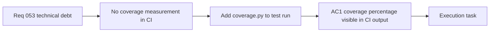

## item_101_day_captain_ci_coverage_reporting - Day Captain CI coverage reporting
> From version: 1.9.3
> Schema version: 1.0
> Status: Done
> Understanding: 100
> Confidence: 99
> Progress: 100%
> Complexity: Low
> Theme: Engineering Quality
> Reminder: Update status/understanding/confidence/progress and linked task references when you edit this doc.

# Problem
- The CI pipeline runs the test suite but does not measure or report coverage.
- Coverage regressions are invisible until a reviewer notices missing tests by reading diffs manually.
- There is no baseline to compare against when adding new code paths.

# Scope
- In:
  - integrate `coverage.py` into the CI test run (`coverage run -m unittest discover`)
  - emit a coverage summary at the end of the CI job (terminal output)
  - establish a minimum threshold that fails the build on significant regression (starting point: current measured coverage)
- Out:
  - uploading reports to a third-party service (Codecov, Coveralls) — can be added later
  - modifying any test logic to improve coverage percentage
  - covering the ops repo or GitHub Actions workflows

# Acceptance criteria
- AC1: CI job runs the test suite through `coverage.py` and prints a coverage summary to the job output.
- AC2: A minimum coverage threshold is defined; the CI job fails if coverage drops below it.
- AC3: The threshold value is documented in `pyproject.toml` (`[tool.coverage.report]`) so future contributors know the contract.

# AC Traceability
- Req053 AC2 → AC1 and AC2. Proof: this item owns the coverage tooling integration.
- request-AC3 -> This backlog slice. Evidence needed: The currently oversized `services.py` functions are trimmed below the agreed line budget or have a documented exception; all existing tests pass unchanged.
- request-AC4 -> This backlog slice. Evidence needed: No `.format()` call constructs SQL strings in `storage.py`; all existing parameterized-query protections are preserved.
- request-AC5 -> This backlog slice. Evidence needed: A burst of more than N rapid requests to any `/jobs/*` endpoint within a sliding window returns HTTP 429 instead of queuing unbounded work; N and the window are operator-configurable.
- request-AC6 -> This backlog slice. Evidence needed: The PostgreSQL storage adapter reuses connections across operations within a single job run rather than opening a new connection per query; SQLite behavior is unchanged.

# Decision framing
- Product framing: Not needed
- Architecture framing: Not needed — tooling change only, no application code touched.

# Links
- Product brief(s): (none yet)
- Architecture decision(s): (none yet)
- Request: `req_053_day_captain_technical_debt_and_runtime_hardening`
- Primary task(s): `task_048_day_captain_technical_debt_hardening_orchestration`

# AI Context
- Summary: Integrate coverage.py into CI, emit a coverage report, and enforce a minimum threshold.
- Keywords: coverage, coverage.py, CI, test coverage, threshold
- Use when: Work targets test coverage measurement or CI quality gates.
- Skip when: Work targets application logic, product features, or delivery.

# References
- CI pipeline: [.github/workflows/ci.yml](.github/workflows/ci.yml)
- Package metadata: [pyproject.toml](pyproject.toml)

# Priority
- Impact: Medium — regressions go undetected without this.
- Urgency: Low — can be added alongside any other CI improvement.

# Notes
- Derived from `req_053_day_captain_technical_debt_and_runtime_hardening`.
- `coverage.py` is the de-facto standard; no additional dependency needed beyond a dev extra in `pyproject.toml`.
- Task `task_048_day_captain_technical_debt_hardening_orchestration` was finished via `logics-manager flow finish task` on 2026-07-12.

# Tasks
- `task_048_day_captain_technical_debt_hardening_orchestration`
