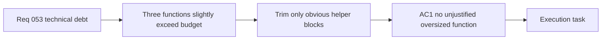

## item_102_day_captain_services_decomposition_large_functions - Day Captain services function size guardrail
> From version: 1.9.3
> Schema version: 1.0
> Status: In progress
> Understanding: 100
> Confidence: 98
> Progress: 100
> Complexity: Low
> Theme: Engineering Quality
> Reminder: Update status/understanding/confidence/progress and linked task references when you edit this doc.

# Problem
- `services.py` is a large module, but the original audit overstated the function-size problem.
- Current inspection found only three functions slightly above 150 lines: `_score_message` (163), `render` (153), and `_score_meeting` (151).
- A broad decomposition wave would be churn. The useful debt item is a small guardrail: trim or justify those few oversized functions and avoid making the module worse.

# Scope
- In:
  - identify functions exceeding 150 lines in `services.py`
  - extract only obvious, behavior-preserving helper blocks from the oversized functions
  - add targeted unit tests only for extracted helpers that contain real branching or parsing logic
  - keep all existing tests passing unchanged after extraction
- Out:
  - changing any scoring weights, thresholds, or observable behavior
  - splitting `services.py` into multiple top-level packages
  - touching functions already under the line budget
  - refactoring `app.py` or adapter modules

# Acceptance criteria
- AC1: No single function in `services.py` exceeds 150 lines unless a short `ponytail:` comment justifies why splitting it would add more complexity than it removes.
- AC2: All existing tests pass unchanged; no test modifications are made just to preserve behavior after refactor.
- AC3: Extracted helpers with meaningful branching have dedicated unit tests.
- AC4: Public API of `services.py` (exported names consumed by `app.py`) is unchanged; callers require no modification.

# AC Traceability
- Req053 AC3 -> AC1, AC2, AC4. Proof: this item owns the behavior-preserving services.py size guardrail.

# Decision framing
- Product framing: Not needed
- Architecture framing: Not needed - intra-module cleanup only; broad module-boundary decisions are explicitly out of scope.

# Links
- Product brief(s): (none yet)
- Architecture decision(s): (none yet)
- Request: `req_053_day_captain_technical_debt_and_runtime_hardening`
- Primary task(s): (orchestration task to be linked)

# AI Context
- Summary: Trim or justify the few services.py functions that exceed the line budget; avoid broad decomposition churn.
- Keywords: services.py, function size, refactor, line budget, unit tests, behavior-preserving
- Use when: Work targets the internal size or readability of the few oversized services.py functions.
- Skip when: Work targets scoring weights, observable digest behavior, delivery, or broad module restructuring.

# References
- Main scoring module: [services.py](src/day_captain/services.py)
- Application orchestration: [app.py](src/day_captain/app.py)

# Priority
- Impact: Low - the module is large, but current oversized functions are only slightly over budget.
- Urgency: Low - do this opportunistically when touching scoring or rendering code.

# Notes
- Derived from `req_053_day_captain_technical_debt_and_runtime_hardening`.
- Downgraded after re-inspection on 2026-07-12; broad decomposition is explicitly out of scope.
- Tackle last, or opportunistically when a nearby scoring/rendering change already needs tests.
