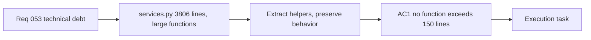

## item_102_day_captain_services_decomposition_large_functions - Day Captain services decomposition large functions
> From version: 1.9.3
> Schema version: 1.0
> Status: Draft
> Understanding: 90%
> Confidence: 85%
> Progress: 0%
> Complexity: High
> Theme: Engineering Quality
> Reminder: Update status/understanding/confidence/progress and linked task references when you edit this doc.

# Problem
- `services.py` is a single 3,806-line module. Several functions span hundreds of lines, making local reasoning expensive and individual unit testing impractical.
- Long functions mix orchestration logic with low-level computation, so a bug in one leaf concern requires reading the entire call chain.
- The existing test suite exercises the module at integration depth; targeted unit tests for isolated scoring steps are hard to write without prior extraction.

# Scope
- In:
  - identify all functions exceeding 150 lines in `services.py`
  - extract logical sub-units into focused, named helpers within the same module or a sibling module
  - ensure all existing tests pass unchanged after extraction (behavior-preserving refactor only)
  - add targeted unit tests for at least the three largest extracted helpers
- Out:
  - changing any scoring weights, thresholds, or observable behavior
  - splitting `services.py` into multiple top-level packages (module structure change is a separate decision)
  - refactoring `app.py` or adapter modules

# Acceptance criteria
- AC1: No single function in `services.py` or its extracted sibling(s) exceeds 150 lines after decomposition.
- AC2: All existing tests pass unchanged — no test modifications to make them pass on the refactored code.
- AC3: At least three of the largest extracted helpers have dedicated unit tests.
- AC4: Public API of `services.py` (exported names consumed by `app.py`) is unchanged; callers require no modification.

# AC Traceability
- Req053 AC3 → AC1, AC2, AC4. Proof: this item owns the behavior-preserving decomposition contract.

# Decision framing
- Product framing: Not needed
- Architecture framing: Not needed — intra-module refactor only; module boundary decisions are deferred.

# Links
- Product brief(s): (none yet)
- Architecture decision(s): (none yet)
- Request: `req_053_day_captain_technical_debt_and_runtime_hardening`
- Primary task(s): (orchestration task to be linked)

# AI Context
- Summary: Split the largest functions in services.py into focused helpers without changing behavior; add unit tests for extracted units.
- Keywords: services.py, decomposition, refactor, large functions, unit tests, behavior-preserving
- Use when: Work targets the internal structure of services.py or individual testability of scoring helpers.
- Skip when: Work targets scoring weights, observable digest behavior, or delivery.

# References
- Main scoring module: [services.py](src/day_captain/services.py)
- Application orchestration: [app.py](src/day_captain/app.py)

# Priority
- Impact: High — current size makes every future change to scoring logic expensive.
- Urgency: Low — no immediate breakage; urgency grows with each new feature touching the module.

# Notes
- Derived from `req_053_day_captain_technical_debt_and_runtime_hardening`.
- The 150-line budget is a starting suggestion; the execution task should confirm or adjust before implementation.
- Highest-complexity item in the batch — tackle last, after simpler items de-risk the CI environment.
