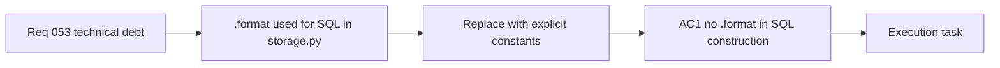

## item_103_day_captain_replace_format_based_sql_construction_in_storage - Day Captain replace format-based SQL construction in storage
> From version: 1.9.3
> Schema version: 1.0
> Status: Done
> Understanding: 100
> Confidence: 99
> Progress: 100%
> Complexity: Low
> Theme: Engineering Quality
> Reminder: Update status/understanding/confidence/progress and linked task references when you edit this doc.

# Problem
- `storage.py` uses `.format()` to assemble SQL WHERE clauses and table-name references from hardcoded string fragments.
- All user-controlled values go through parameterized placeholders (`?`), so the current implementation is safe from SQL injection.
- However, the `.format()` pattern is visually indistinguishable from unsafe string concatenation. Future contributors may extend the pattern incorrectly, and static analysis tools flag it as a false positive.
- Replacing it with explicit constants or literal-only builders removes the ambiguity and makes the safety contract self-evident at a glance.

# Scope
- In:
  - locate every `.format()` call that constructs a SQL fragment in `storage.py`
  - replace with explicit string constants or a literal-only clause builder (e.g. `" AND ".join(clauses)` where `clauses` is a list of hardcoded strings)
  - ensure all parameterized placeholder bindings (`?`) are unchanged
  - existing tests must pass without modification
- Out:
  - introducing an ORM or external query builder dependency
  - changing any query logic or result behavior
  - touching `app.py` or other modules

# Acceptance criteria
- AC1: No `.format()` call is used to construct any SQL fragment in `storage.py`.
- AC2: All parameterized placeholder bindings (`?` or `%s`) are preserved exactly as they were.
- AC3: All existing tests pass unchanged.
- AC4: A code reviewer reading `storage.py` can identify safe vs. unsafe SQL construction at a glance without tracing call chains.

# AC Traceability
- Req053 AC4 → AC1, AC2, AC4. Proof: this item owns the SQL construction pattern safety contract.
- request-AC3 -> This backlog slice. Evidence needed: The currently oversized `services.py` functions are trimmed below the agreed line budget or have a documented exception; all existing tests pass unchanged.
- request-AC5 -> This backlog slice. Evidence needed: A burst of more than N rapid requests to any `/jobs/*` endpoint within a sliding window returns HTTP 429 instead of queuing unbounded work; N and the window are operator-configurable.
- request-AC6 -> This backlog slice. Evidence needed: The PostgreSQL storage adapter reuses connections across operations within a single job run rather than opening a new connection per query; SQLite behavior is unchanged.

# Decision framing
- Product framing: Not needed
- Architecture framing: Not needed — no change to persistence model or query semantics; purely a code pattern cleanup.

# Links
- Product brief(s): (none yet)
- Architecture decision(s): (none yet)
- Request: `req_053_day_captain_technical_debt_and_runtime_hardening`
- Primary task(s): `task_048_day_captain_technical_debt_hardening_orchestration`

# AI Context
- Summary: Replace all .format()-based SQL assembly in storage.py with explicit constants or literal-only builders, keeping parameterized bindings intact.
- Keywords: SQL, format, string interpolation, storage.py, SQL injection pattern, parameterized query
- Use when: Work targets SQL construction patterns in the storage adapter.
- Skip when: Work targets query logic, schema, or persistence model.

# References
- Storage adapter: [adapters/storage.py](src/day_captain/adapters/storage.py)

# Priority
- Impact: Low — no current correctness issue; prevents future mistakes.
- Urgency: Low — straightforward mechanical change, low risk. Good warm-up item.

# Notes
- Derived from `req_053_day_captain_technical_debt_and_runtime_hardening`.
- Lowest-risk item in the batch — recommended to tackle first.
- Task `task_048_day_captain_technical_debt_hardening_orchestration` was finished via `logics-manager flow finish task` on 2026-07-12.

# Tasks
- `task_048_day_captain_technical_debt_hardening_orchestration`
