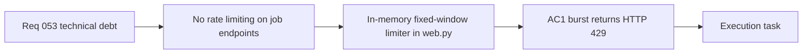

## item_104_day_captain_rate_limiting_on_job_endpoints - Day Captain rate limiting on job endpoints
> From version: 1.9.3
> Schema version: 1.0
> Status: Draft
> Understanding: 95%
> Confidence: 90%
> Progress: 0%
> Complexity: Low
> Theme: Engineering Quality
> Reminder: Update status/understanding/confidence/progress and linked task references when you edit this doc.

# Problem
- The `/jobs/morning-digest`, `/jobs/weekly-digest`, `/jobs/recall-digest`, and `/jobs/email-command-recall` endpoints are protected by a shared secret (`X-Day-Captain-Secret`) but have no rate limiting.
- A misconfigured scheduler, a credential leak, or a retry loop could produce a burst of requests that queues unbounded digest work against the Graph API and LLM provider.
- The current protection model relies entirely on secret correctness; a rate limit provides defense-in-depth at the HTTP layer.

# Scope
- In:
  - implement a per-endpoint fixed-window rate limiter in `web.py` using only the standard library
  - make the window size and request limit operator-configurable via environment variables with safe defaults
  - return HTTP 429 with a `Retry-After` header when the limit is exceeded
  - add tests covering the 429 response path and the window-reset behavior
- Out:
  - rate limiting unauthenticated or read-only endpoints (`/healthz`)
  - distributed rate limiting across multiple Render instances (single-process in-memory is sufficient for current deployment)
  - introducing an external middleware dependency

# Acceptance criteria
- AC1: A burst of more than N requests to any `/jobs/*` endpoint within a configured window returns HTTP 429 instead of queuing work; N and the window are set via environment variables.
- AC2: The response includes a `Retry-After` header indicating when the window resets.
- AC3: Legitimate single requests spaced further apart than the window period are not rate-limited.
- AC4: Tests cover the 429 path, the `Retry-After` header value, and the window-reset behavior.
- AC5: Default values for N and the window are documented in `.env.example`.

# AC Traceability
- Req053 AC5 → AC1, AC2, AC3. Proof: this item owns the rate limiting contract for job endpoints.

# Decision framing
- Product framing: Not needed
- Architecture framing: Not needed — in-memory limiter scoped to single process; no cross-instance coordination required at current deployment scale.

# Links
- Product brief(s): (none yet)
- Architecture decision(s): (none yet)
- Request: `req_053_day_captain_technical_debt_and_runtime_hardening`
- Primary task(s): (orchestration task to be linked)

# AI Context
- Summary: Add an in-memory fixed-window rate limiter to all /jobs/* endpoints in web.py, returning HTTP 429 on burst with operator-configurable thresholds.
- Keywords: rate limiting, HTTP 429, job endpoints, web.py, fixed window, burst protection
- Use when: Work targets the HTTP layer of the job endpoints or request flood protection.
- Skip when: Work targets digest logic, scheduling, or delivery.

# References
- HTTP endpoints: [web.py](src/day_captain/web.py)
- Environment config: [config.py](src/day_captain/config.py)
- Example env: [.env.example](.env.example)

# Priority
- Impact: Medium — prevents operational runaway under misconfiguration or credential leak.
- Urgency: Low — no active incident; adds meaningful defense-in-depth.

# Notes
- Derived from `req_053_day_captain_technical_debt_and_runtime_hardening`.
- Suggested default: 5 requests per 60-second window per endpoint.
- The limiter must apply after secret validation to avoid leaking timing information on rejected requests.
