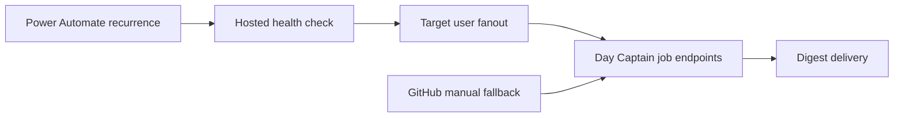

## prod_001_day_captain_operations_scheduler_reliability - Day Captain operations scheduler reliability
> Date: 2026-07-12
> Status: Active
> Related request: `req_054_day_captain_power_automate_scheduler_migration`
> Related backlog: `item_106_document_the_power_automate_scheduler_flows`
> Related task: `task_049_orchestrate_power_automate_scheduler_migration`
> Related architecture: (none yet)
> Reminder: Update status, linked refs, scope, decisions, success signals, and open questions when you edit this doc.

# Overview
Move production digest scheduling from best-effort GitHub Actions cron to tenant-owned Power Automate recurrence while keeping Day Captain's hosted job API as the execution boundary.

# Goals
- Deliver weekday morning digests at the intended Europe/Paris wall-clock time with less scheduler drift.
- Reduce scheduler latency by removing Git checkout, Python setup, and local package installation from routine production triggers.
- Keep secrets in operational control planes and out of the application repository.
- Keep the migration operationally reversible during rollout.

# Non-goals
- Rewriting Day Captain digest generation, Graph ingestion, delivery, or storage logic inside Power Automate.
- Changing the hosted job authentication mechanism beyond the existing X-Day-Captain-Secret contract.
- Changing digest content, delivery mode, target-user identity resolution, or cursor behavior.
- Replacing Render hosting or the hosted web service architecture.

# Scope and guardrails
- In: production scheduling ownership, Power Automate flow documentation, ops runbook updates, safe cutover, and rollback guidance.
- Out: digest generation logic, Graph ingestion, delivery rendering, storage, hosted job authentication redesign, and Render hosting changes.

# Key product decisions
- Power Automate owns recurrence timing; Day Captain continues to own all digest business logic through the existing hosted job endpoints.
- GitHub Actions remains available only as a manual fallback during and after cutover.
- Successful live Power Automate runs are required before disabling GitHub schedule triggers.

# Success signals
- Weekday morning digest delivery happens near the intended Europe/Paris morning slot instead of drifting toward midday.
- Weekly digest delivery keeps the Sunday evening contract without relying on GitHub cron jitter tolerance.
- Operators can see where secrets live, how to test the flows, and how to roll back without exposing mailbox content or secrets.

# References
- Product back-reference: `item_106_document_the_power_automate_scheduler_flows`
- Task back-reference: `task_049_orchestrate_power_automate_scheduler_migration`
