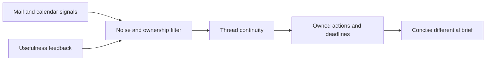

## prod_002_day_captain_actionable_differential_brief - Day Captain actionable differential brief
> Date: 2026-07-12
> Status: Accepted
> Related request: `req_055_day_captain_production_digest_actionability_improvement`
> Related backlog: `item_109_reduce_digest_noise_and_enforce_concise_section_budgets`, `item_110_generate_concrete_owner_aware_actions_and_deadlines`, `item_111_turn_recent_run_memory_into_a_differential_commitment_view`, `item_112_make_upcoming_meetings_preparation_and_conflict_aware`, `item_113_improve_digest_presentation_personalization_and_usefulness_telemetry`
> Related task: `task_050_orchestrate_production_digest_actionability_improvements`
> Related architecture: (none yet)
> Reminder: Update status, linked refs, scope, decisions, success signals, and open questions when you edit this doc.

# Overview
Make each digest answer what changed, what the recipient personally needs to do, when it is due, and what can safely be ignored.

# Goals
- Cut routine digest reading effort by reducing repeated and generic content.
- Prioritize concrete user-owned commitments, deadlines, delivery failures, and meeting preparation.
- Use stable thread continuity to explain changes across runs instead of repeating complete mailbox snapshots.
- Keep ambient context such as weather and external news subordinate to operational work.
- Measure whether surfaced cards lead to useful opens, recalls, feedback, or completed follow-up.
- Prevent authentication secrets and other prohibited sensitive content from entering storage, LLM prompts, telemetry, or rendered briefs.
- Validate the delivered HTML visually and roll out changes without contacting non-test recipients.

# Non-goals
- Building a general-purpose task-management platform.
- Automatically sending replies, accepting meetings, or completing commitments on behalf of a user.
- Replacing Microsoft Graph, the existing delivery adapter, or the current storage abstraction.
- Adding a new machine-learning service solely for ranking or confidence calibration.
- Persisting raw mailbox content in analytics or exposing production identities in fixtures and documentation.

# Scope and guardrails
- In: sensitive-content suppression, least-privilege mailbox access, signal selection, action ownership, deadline extraction, thread continuity, meeting preparation, concise rendering, ambient-content controls, feedback, content-free usefulness measurement, replay, visual QA, and safe rollout.
- Out: autonomous replies or meeting changes, a separate task-management platform, a new ranking service, cross-user state sharing, covert read tracking, raw mailbox content in telemetry, and live test delivery to any recipient other than the explicitly authorized test mailbox.

# Key product decisions
- Reuse existing deterministic scoring, ownership, continuity, preference, feedback, and storage primitives before adding architecture.
- Treat unread state as display metadata rather than priority.
- Show only concrete user-owned or shared actions; represent other-owned work as waiting context.
- Prefer stable thread identity and cross-run deltas over repeated mailbox snapshots.
- Keep weather and relevant external news optional and subordinate to operational work.
- Measure usefulness without storing message bodies, subjects, names, or addresses in telemetry.
- Block authentication secrets before persistence and LLM boundaries rather than attempting to redact them after rendering.
- Require rendered visual QA and restrict any necessary live test send to one explicitly authorized test mailbox.

# Success signals
- Routine briefs are materially shorter and contain fewer generic actions and unchanged repeated cards than the anonymized baseline.
- Delivery failures, explicit deadlines, overdue commitments, and user-owned actions consistently outrank ambient or low-signal content.
- Meeting preparation appears only when supported by a document, decision, commitment, question, or explicit request.
- Daily and weekly briefs are distinguishable and operational content appears before optional weather or news.
- Aggregate feedback shows whether users open, recall, suppress, or mark surfaced items useful without exposing mailbox content.
- Replay and aggregate audits demonstrate at least 40% shorter median briefs, 80% fewer generic actions, zero surfaced authentication secrets, and no regression in multi-user isolation or critical delivery-failure handling.

# References
- Product back-reference: `req_055_day_captain_production_digest_actionability_improvement`
- Task back-reference: `task_050_orchestrate_production_digest_actionability_improvements`
