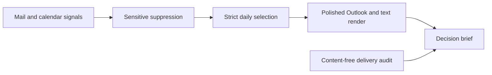

## prod_004_day_captain_strict_decision_brief - Day Captain strict decision brief
> Date: 2026-07-23
> Status: Proposed
> Related request: `req_057_day_captain_digest_friction_hardening`
> Related backlog: `item_120_close_authentication_message_suppression_gaps`, `item_121_make_daily_output_a_strict_command_brief`, `item_122_polish_outlook_and_text_rendering_ergonomics`, `item_123_diagnose_sender_delivery_count_anomalies_without_mailbox_content`
> Related task: `task_054_orchestrate_digest_friction_hardening`
> Related architecture: (none yet)
> Reminder: Update status, linked refs, scope, decisions, success signals, and open questions when you edit this doc.
> Non-semantic edit: Expanded scaffolded product brief with public-safe product detail.

# Overview
Make each delivered email feel like a concise command brief: no temporary secrets, no filler, no repeated controls, and no operational ambiguity.

# Goals
- Make sensitive-authentication suppression comprehensive and regression-tested with synthetic bypass cases.
- Cut routine daily reading cost by hiding ambient content and generic uncertainty unless it changes the user's action.
- Make the first screen of the email answer the user's next actions, waiting items, conflicts, and ignored noise.
- Improve delivered-email craft so text spacing, button grouping, language, and metadata look intentional in Outlook and plain text.
- Give operators content-free delivery-count diagnostics that explain duplicate or missing sends without mailbox exports.

# Non-goals
- Persisting real mailbox-derived audit artifacts in the repository.
- Adding tracking pixels or covert read tracking.
- Automatically replying to mail or modifying calendar events.
- Replacing Microsoft Graph, the existing scheduler model, or the existing storage abstraction.
- Building a full external-news personalization engine.

# Scope and guardrails
- In: sensitive-authentication suppression, stricter daily selection, external-news relevance, confidence-label rendering, Outlook/text spacing, compact open controls, content-free delivery-count diagnostics, and public-safe aggregate evidence.
- Out: raw mailbox-derived fixtures, autonomous replies or calendar changes, new delivery transport, new analytics platform, and broad redesign of the scheduler.

# Key product decisions
- Block temporary authentication content at the earliest shared boundary and prove absence downstream with synthetic fixtures.
- Treat daily briefs as command briefs; weekly briefs may remain broader but still bounded.
- Make external news subordinate and relevance-gated rather than always present.
- Render confidence only when it changes the user's decision, and localize it consistently.
- Keep mailbox audit evidence temporary and summarize only content-free counts in workflow docs.

# Success signals
- Synthetic authentication bypass fixtures produce no stored, scored, rendered, recalled, metric, or replay output.
- Daily briefs are shorter, contain fewer rendered controls, and omit unrelated external news by default.
- French output has no mixed-language confidence labels and no concatenated text/button artifacts.
- Delivery diagnostics explain duplicate or missing send counts without addresses, subjects, previews, bodies, run IDs, or hosted URLs.
- Focused tests, full tests, replay, metrics, lint, audit, and visual QA pass before closeout.

# References
- Product back-reference: `req_057_day_captain_digest_friction_hardening`
- Task back-reference: `task_054_orchestrate_digest_friction_hardening`
