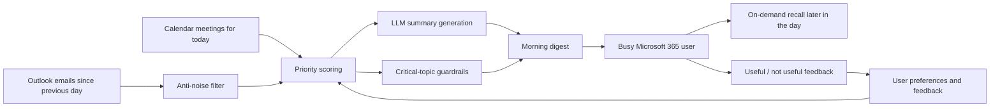

## req_000_day_captain_daily_assistant_for_microsoft_365 - Day Captain daily assistant for Microsoft 365
> From version: 0.1.0
> Status: In Progress
> Understanding: 100%
> Confidence: 99%
> Complexity: High
> Theme: Productivity
> Reminder: Update status/understanding/confidence and references when you edit this doc.

# Needs
- Build a daily assistant for a heavy Microsoft 365 user who receives a large Outlook email volume and attends many Teams meetings.
- Deliver a morning brief that highlights only what matters since the previous day: critical topics, expected actions, watch items, and upcoming meetings with useful context.
- Avoid summarizing every email. The system must prioritize signal over exhaustiveness.
- Support a later recall/reminder on demand during the day.
- Learn progressively from user feedback so the brief reflects personal relevance instead of static generic importance rules.
- Keep strong guardrails so personalization never hides a truly critical topic.

# Context
- Primary data sources are Microsoft 365 Outlook mail and calendar.
- Microsoft Graph is the official integration layer for reading email/calendar data and optionally sending the digest back through Outlook.
- Authentication and authorization should rely on a Microsoft Entra ID app registration with the minimum Graph permissions required for V1.
- The preferred business logic runtime is Python.
- The preferred V1 runtime is a hosted Python service on `Render`.
- The preferred V1 scheduler is `GitHub Actions` cron invoking the hosted service, with Render-native cron as a later hardening option.
- The system should use a lightweight local datastore during development (`SQLite`), but a hosted deployment should target a managed relational store compatible with the same schema, preferably `Postgres` on Render, to persist:
  - processed emails or threads
  - user preferences
  - morning brief snapshots
  - explicit feedback such as "useful" / "not useful"
- LLM usage must stay low-cost by limiting context and number of calls to a few requests per day.
- V1 delivery assumptions have been narrowed for implementation planning:
  - single-user deployment first
  - delegated Microsoft Graph auth first
  - one scheduled morning digest run plus same-day recall on demand
  - deterministic scoring and filtering first, with the LLM used only on shortlisted items for digest wording
- V1 application modules are expected to include:
  - mail collector
  - calendar collector
  - anti-noise filter
  - scoring/prioritization engine
  - summarizer
  - digest renderer
  - recall service
  - feedback engine
- The preferred V1 deployment topology is:
  - Render web service for the Python application
  - GitHub Actions scheduled workflow for the morning trigger
  - Microsoft Graph for mail/calendar ingestion and optional digest send
  - Render Postgres for hosted persistence, with `SQLite` kept for local development and tests
- In scope for V1:
  - daily morning digest
  - meeting-aware prioritization
  - lightweight personalization
  - optional reminder later in the day
- Out of scope for V1:
  - full mailbox assistant behavior
  - real-time copilot experience
  - complex UI beyond email-based delivery
  - advanced enterprise analytics/reporting
- Main risks and constraints:
  - Graph permission model differs depending on delegated vs application auth
  - user personalization must not suppress critical business signals
  - noisy corporate mail patterns may require iterative filtering rules

# Acceptance criteria
- AC1: The system can fetch emails received since the previous digest window and upcoming meetings for the current day through Microsoft Graph.
- AC2: The morning output is a concise digest containing at least these sections: critical topics, actions to take, watch items, and upcoming meetings with context.
- AC3: The digest excludes obvious low-value noise such as newsletters, generic notifications, and low-signal CC traffic when confidence is sufficient.
- AC4: The prioritization logic combines generic importance signals with user-specific preferences, while preserving a guardrail path for potentially critical topics.
- AC5: A user can trigger a later reminder during the day using the same stored context without recomputing the full history from scratch.
- AC6: The system persists processed-message state, digest history, and user feedback in a lightweight relational datastore, with `SQLite` for local runs and a Postgres-compatible schema for hosted deployment.
- AC7: The proposed V1 architecture is explicitly based on Microsoft Graph + Python + Render hosting + GitHub Actions scheduling + LLM + relational storage.
- AC8: The implementation approach is compatible with a first deployment using Render, GitHub Actions, Render Postgres, and Outlook/Graph-based delivery.

# Definition of Ready (DoR)
- [x] Problem statement is explicit and user impact is clear.
- [x] Scope boundaries (in/out) are explicit.
- [x] Acceptance criteria are testable.
- [x] Dependencies and known risks are listed.

# Backlog
- `item_000_day_captain_daily_assistant_for_microsoft_365` - V1 delivery slice refined by `spec_000_day_captain_v1_digest_contract`.
- `task_000_day_captain_daily_assistant_for_microsoft_365` - Freeze the V1 contract and bootstrap the service skeleton. Status: `Delivered, pending chain closure`.
- `task_001_day_captain_graph_ingestion_and_storage` - Implement Graph ingestion and SQLite persistence. Status: `Delivered, pending chain closure`.
- The repository now includes Microsoft Entra ID device-code auth and token cache handling for delegated Microsoft Graph access in local/CLI flows.
- `task_002_day_captain_digest_scoring_recall_and_delivery` - Implement scoring, digest rendering, recall, and webhook/Graph-send delivery. Status: `Delivered, pending chain closure`.
- `task_003_day_captain_render_deployment_and_scheduler` - Package the hosted deployment path on Render with GitHub Actions scheduling and Postgres-backed persistence. Status: `Ready`.
