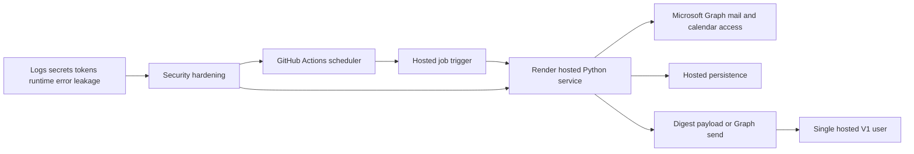

## req_001_day_captain_hosted_security_hardening - Day Captain hosted deployment security hardening
> From version: 0.1.0
> Status: Done
> Understanding: 100%
> Confidence: 98%
> Complexity: High
> Theme: Security
> Reminder: Update status/understanding/confidence and references when you edit this doc.

# Needs
- Harden the hosted Day Captain deployment path before treating Render + GitHub Actions as production-ready.
- Prevent mailbox-derived digest content from leaking through GitHub Actions logs, HTTP responses, or generic runtime error messages.
- Make hosted trigger security explicit and non-optional so the service cannot start in an exposed configuration by accident.
- Replace development-grade runtime and token-handling assumptions with hosted-safe operational controls.
- Preserve the current single-user Microsoft Graph workflow and digest behavior while tightening the attack surface.

# Context
- The current hosted topology targets:
  - Render web service for the Python runtime
  - GitHub Actions scheduled trigger for the morning run
  - Microsoft Graph for Outlook/calendar ingestion and optional digest send
  - Postgres-backed persistence in hosted mode, with `SQLite` kept for local development
- The current implementation already works functionally, but several security gaps remain in the hosted path:
  - the scheduled GitHub Actions call currently receives the full digest response body, which risks exposing mailbox-derived data in workflow logs
  - hosted job endpoints rely on a shared secret header, but the current service behavior should make that protection mandatory in hosted environments
  - the HTTP surface currently returns raw exception text on unhandled failures, which can leak internals
  - the current hosted runtime uses a minimal standard-library WSGI server rather than a hardened production process model
  - delegated token caching is still file-based, which is acceptable for local CLI flows but not a strong default for hosted deployment
- In scope for this hardening request:
  - scheduler log hygiene
  - hosted endpoint authentication hardening
  - safer HTTP response policy
  - production runtime hardening for the web service
  - safer hosted token/secret handling assumptions
  - explicit transport/storage security expectations for hosted database connectivity
- Out of scope for this request:
  - rethinking the core digest scoring logic
  - moving away from Microsoft Graph or delegated auth in V1
  - multi-user tenancy
  - enterprise SSO redesign beyond the current Entra app approach

# Acceptance criteria
- AC1: The scheduled trigger path does not emit digest bodies, mailbox previews, or other mailbox-derived content into GitHub Actions logs during normal operation.
- AC2: Hosted job endpoints require an explicit authentication secret or equivalent guardrail in non-development environments; the service must not silently run exposed in hosted mode.
- AC3: Hosted HTTP responses return minimal operational acknowledgements for scheduled jobs and avoid returning raw internal exception details to remote callers.
- AC4: The hosted web runtime uses a production-serving process model instead of the standard-library development server.
- AC5: Hosted delegated token handling no longer relies on a plaintext local file cache as the default persistence mechanism.
- AC6: Hosted database connectivity and secret usage are documented and configured with secure transport expectations, including TLS/SSL requirements where applicable.
- AC7: The hardening changes remain compatible with the current single-user Graph-based digest flow and do not break local development with `.env` + `SQLite`.
- AC8: The security controls are validated by automated tests and an explicit hosted deployment checklist.

# Definition of Ready (DoR)
- [x] Problem statement is explicit and user impact is clear.
- [x] Scope boundaries (in/out) are explicit.
- [x] Acceptance criteria are testable.
- [x] Dependencies and known risks are listed.

# Backlog
- `item_001_day_captain_hosted_security_hardening` - Hardening slice for the hosted Render + GitHub Actions deployment path.
- `task_004_day_captain_hosted_security_hardening` - Implement hosted security hardening for trigger auth, runtime, token handling, and deployment controls. Status: `Done`.
