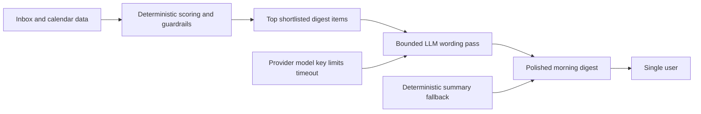

## req_002_day_captain_llm_digest_wording_for_shortlisted_items - Day Captain LLM wording layer for shortlisted digest items
> From version: 0.2.0
> Status: Done
> Understanding: 99%
> Confidence: 98%
> Complexity: High
> Theme: AI
> Reminder: Update status/understanding/confidence and references when you edit this doc.

# Needs
- Add the missing LLM layer that was always part of the Day Captain V1 intent, but is not yet implemented in the codebase.
- Improve the wording quality of the morning digest without replacing the existing deterministic scoring, guardrails, or anti-noise logic.
- Keep LLM usage cheap and predictable by sending only a small shortlist of already-prioritized items instead of raw mailbox volume.
- Ensure the daily digest still works when the LLM is disabled, misconfigured, rate-limited, or unavailable.
- Make the LLM provider, model, secret handling, and request budget explicit enough to deploy locally and on Render without guesswork.

# Context
- The product request `req_000_day_captain_daily_assistant_for_microsoft_365` already narrowed V1 toward deterministic scoring first and LLM usage only on shortlisted items for digest wording.
- The current implementation includes:
  - Microsoft Graph ingestion for mail and meetings
  - deterministic prioritization and anti-noise filtering
  - digest rendering, recall, and feedback
  - hosted Render + GitHub Actions scaffolding with security hardening
- The current gap is specifically the wording layer:
  - digest summaries are still built from heuristic preview extraction and fixed prefixes such as `Critical:` or `Action requested:`
  - there is no provider abstraction or runtime configuration for an LLM summarizer
  - there is no bounded prompt budget tied to the shortlisted digest items
- In scope for this request:
  - provider-configurable LLM wording for shortlisted digest items
  - explicit environment settings for provider, model, key, timeout, and shortlist budget
  - safe fallback to deterministic summaries when the LLM path is unavailable
  - automated tests for config parsing, prompt/result handling, and failure fallback
- Out of scope for this request:
  - replacing deterministic scoring with model-driven ranking
  - prompting over the full mailbox or arbitrary historical context
  - multi-step agents, tool use, or autonomous email actions
  - UI work beyond the current digest delivery surfaces

# Acceptance criteria
- AC1: The LLM is applied only after deterministic prioritization and only to a bounded shortlist of digest items; the system does not send the entire mailbox window to the model.
- AC2: If the LLM provider is disabled, misconfigured, or fails at runtime, the digest still completes successfully with deterministic summaries.
- AC3: The LLM integration is configured through explicit environment settings covering provider selection, model, API key, timeout, and shortlist/token budget.
- AC4: The wording layer preserves each digest item's section, source identity, and guardrail outcome while improving summary phrasing.
- AC5: The implementation keeps daily model usage low-cost by limiting the number of LLM calls and the number of items included per call.
- AC6: Automated tests cover the config surface, provider request/response parsing, and fallback behavior.
- AC7: The LLM wording path remains compatible with both local runs and the hosted Render deployment model.
- AC8: The resulting docs clearly explain how the new AI layer fits into the existing Graph -> scoring -> digest pipeline.

# Definition of Ready (DoR)
- [x] Problem statement is explicit and user impact is clear.
- [x] Scope boundaries (in/out) are explicit.
- [x] Acceptance criteria are testable.
- [x] Dependencies and known risks are listed.

# Backlog
- `item_002_day_captain_llm_digest_wording_for_shortlisted_items` - Implement the bounded LLM wording slice on top of deterministic scoring. Status: `Done`.
- `task_005_day_captain_llm_digest_wording_for_shortlisted_items` - Add provider-configurable LLM summarization with deterministic fallback and tests. Status: `Done`.
