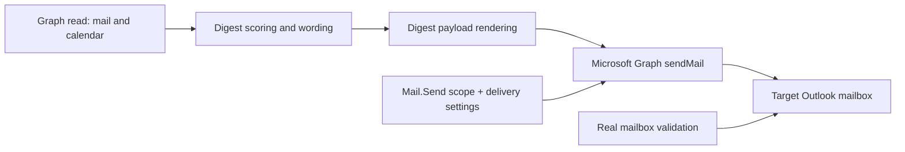

## req_003_day_captain_graph_send_and_mailbox_delivery_validation - Day Captain real Outlook delivery and mailbox validation
> From version: 0.3.0
> Status: Done
> Understanding: 100%
> Confidence: 99%
> Complexity: High
> Theme: Delivery
> Reminder: Update status/understanding/confidence and references when you edit this doc.

# Needs
- Move `graph_send` from a payload-generation mode to a real delegated Outlook delivery path.
- Prove the full chain end to end with an actual message received in the target mailbox, not only a JSON payload or local console output.
- Make the delegated `Mail.Send` requirement explicit in config, auth, and validation steps so the send path can be exercised predictably.
- Preserve the existing local digest flow when mail sending is disabled or not configured.
- Keep failure behavior clear and safe when the app is asked to send but the Graph send prerequisites are missing.

# Context
- The current repository already supports:
  - delegated Microsoft Graph auth for read scopes
  - real inbox/calendar ingestion
  - digest scoring, rendering, recall, and bounded LLM wording
  - a `graph_send` payload shape inside the digest renderer
- The current gap is operationally specific:
  - the app currently builds `graph_message` content for `graph_send`, but does not call Microsoft Graph `sendMail`
  - the local `.env` still uses `DAY_CAPTAIN_DELIVERY_MODE=json`
  - the local Graph scopes do not currently include `Mail.Send`
  - a mailbox-delivery proof requires both implementation work and a manual delegated-auth validation pass
- In scope for this request:
  - actual delegated Graph send execution for digest delivery
  - explicit config and auth prerequisites for `Mail.Send`
  - a manual end-to-end validation path that confirms message receipt in the mailbox
  - tests and docs for the real send behavior
- Out of scope for this request:
  - HTML email templating
  - multi-user routing or recipient selection workflows
  - attachment sending
  - queueing, retries, or background worker architecture beyond the current sync flow

# Acceptance criteria
- AC1: `graph_send` triggers a real delegated Microsoft Graph send operation instead of stopping at payload construction.
- AC2: The send path requires explicit prerequisites for delegated `Mail.Send` usage and fails clearly when those prerequisites are missing.
- AC3: Local and hosted configuration/docs explain how to enable `graph_send`, `Mail.Send`, and the required auth refresh flow.
- AC4: Automated tests cover the Graph send request construction and app behavior around the send path.
- AC5: A manual validation task exists and is specific enough to confirm message receipt in the target mailbox.
- AC6: The existing non-send local digest flow remains usable when mail sending is disabled.
- AC7: The implementation remains compatible with the existing Render + GitHub Actions deployment model.
- AC8: The Logics chain cleanly separates code implementation from real mailbox validation.

# Definition of Ready (DoR)
- [x] Problem statement is explicit and user impact is clear.
- [x] Scope boundaries (in/out) are explicit.
- [x] Acceptance criteria are testable.
- [x] Dependencies and known risks are listed.

# Backlog
- `item_003_day_captain_graph_send_and_mailbox_delivery_validation` - Add real delegated Outlook delivery and validate mailbox receipt. Status: `Done`.
- `task_006_day_captain_graph_send_delivery_execution` - Implement real Graph `sendMail` execution and config/auth guardrails. Status: `Done`.
- `task_007_day_captain_mailbox_delivery_end_to_end_validation` - Validate the delegated send flow end to end against the real mailbox. Status: `Done`.
